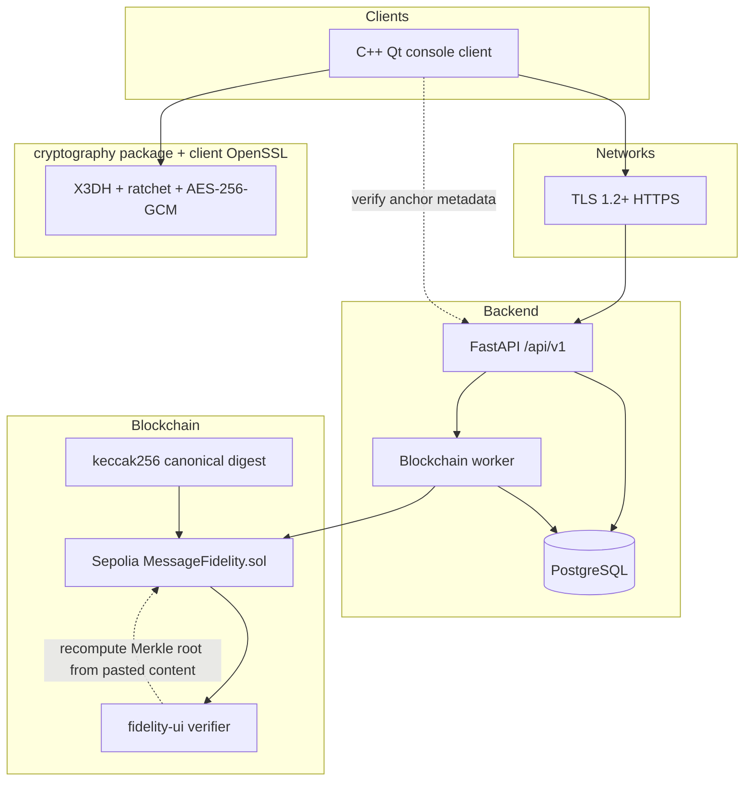

# Epic Messaging (CS4455)

Team **kfc** — secure messaging for the Cybersecurity Epic Project 2026.

This repository is the complete submission for a secure 1:1 messaging system. It demonstrates **confidentiality**, **integrity**, and **authenticity** across four assessed areas: **computer networks & cybersecurity**, **C++ programming**, **cryptography**, and **blockchain**. The server is an honest-but-curious relay: it stores ciphertext, public keys, and metadata only — not message plaintext or private keys.

**Deployed API (TLS):** `https://kfc.theburkenator.com/api/v1` — interactive OpenAPI at `https://kfc.theburkenator.com/docs`.

---

## How the system fits the brief

| Requirement | Where it lives | How it is met |
|-------------|----------------|---------------|
| Secure client/server connectivity | `client/`, `server/backend/`, Nginx on VM | HTTPS to `*.theburkenator.com`; Qt/OpenSSL and browsers validate certificates (no verification bypass in real mode) |
| End-to-end authenticated encryption | `cryptography/`, `client/src/crypto/` | Signal-style X3DH + Double Ratchet concepts; AES-256-GCM wire payloads (`libsignal-v1`); server stores opaque `wire_payload_json` |
| C++ client component | `client/` | Qt Console Application (C++20): registration, login, send/receive, inbox, forward, revoke, delete, download, trust, blockchain verify |
| Backend / database | `server/backend/` | FastAPI + PostgreSQL: auth, pre-keys, message relay, audit logs, pending blockchain anchors |
| Blockchain message fidelity | `blockchain/`, backend worker | `keccak256` digests on Ethereum Sepolia; standalone `fidelity-ui/` verifier |
| Design notes, threat model, testing, AI artefacts | `docs/`, `server/docs/`, per-module READMEs | See [Documentation map](#documentation-map) below |

---

## System overview

Three independent security layers stack on top of each other. Keep them separate when explaining the design to an examiner:

| Layer | Protects against | Does *not* hide from |
|-------|------------------|----------------------|
| **TLS** | Passive/active attackers on the network path to the VM | The server operator (TLS terminates at your infrastructure) |
| **E2EE** | Server reading or forging message plaintext | Metadata (who messaged whom, when, sizes), ciphertext blobs |
| **Blockchain digest** | Undetected change to an anchored conversation/message record hash | Message content (hashes are public on Sepolia) |



### Typical message flow

1. **Register / login** — Client calls `POST /api/v1/auth/register` and `POST /api/v1/auth/login` over TLS. The backend hashes passwords with **Argon2id** (`server/backend/app/services/password_service.py`), matching the parameters documented in `cryptography/` and [docs/cryptography.md](./docs/cryptography.md).
2. **Publish keys** — Client generates X25519/Ed25519 device material locally, uploads **public** pre-key bundles via `PUT /api/v1/keys/devices/{device_id}` and one-time pre-keys via `POST /api/v1/keys/devices/{device_id}/one-time-prekeys`.
3. **Trust (TOFU)** — Before first send, the C++ client can pin a contact’s identity key (`/trust`). The TypeScript reference implementation exposes `verifyIdentityTofu` / `pinIdentity` in `cryptography/src/signal/tofu.ts`.
4. **Send** — Sender fetches recipient bundle (`GET /api/v1/keys/users/{user_id}/bundle`), encrypts locally, posts opaque JSON to `POST /api/v1/messages`. The backend creates a **pending** `blockchain_anchors` row (Keccak digest of a canonical encrypted record — no plaintext).
5. **Receive** — Recipient polls `GET /api/v1/messages/received`, decrypts with local private state, displays plaintext in the console.
6. **Anchor** — The separate **blockchain worker** (`server/backend/app/workers/blockchain_worker.py`) submits pending digests to Sepolia. Clients check status via `GET /api/v1/messages/{id}/anchor` and `POST /api/v1/blockchain/verify`.
7. **Integrity proof (optional)** — Anyone can recompute a conversation Merkle root in [blockchain/fidelity-ui/](./blockchain/fidelity-ui/) and compare to on-chain data (see [blockchain/GUIDE.md](./blockchain/GUIDE.md)).

---

## Repository layout

```
Epic Messaging/
├── client/              # C++20 / Qt console client (assessed C++ component)
├── cryptography/        # TypeScript npm package: protocol reference + utilities
├── server/
│   ├── backend/         # FastAPI application, Alembic, tests, deploy scripts
│   └── docs/            # Backend architecture, API contract, security evidence
├── blockchain/          # Solidity, Hardhat, Sepolia scripts, fidelity-ui
├── docs/                # Cross-cutting design: crypto, threat model, integration
├── AGENTS.md            # Team working rules and security constraints (for developers)
└── README.md            # This file — start here for examiners
```

---

## Components (what each part does)

### `server/backend/` — Networks & relay API

**Role:** Authenticate users, enforce access control, store public keys and opaque ciphertext, audit security-relevant actions, queue blockchain anchors. **Does not** decrypt messages, hold private keys, or call Sepolia from HTTP handlers.

| Area | Implementation |
|------|----------------|
| Stack | Python 3.12+, FastAPI, async SQLAlchemy, PostgreSQL, Alembic, JWT access + refresh tokens |
| API surface | `/api/v1/auth/*`, `/keys/*`, `/messages/*`, `/users/*`, `/blockchain/*` ([server/docs/api/api_contract.md](./server/docs/api/api_contract.md)) |
| Messaging | Direct 1:1 relay: send, list received/sent, get by id, **forward**, **revoke**, **delete**; wire payload validated as opaque `libsignal-v1` JSON |
| Security | Rate limits, security headers, HTTPS enforcement options, audit logs, pytest security suite |
| Blockchain | `blockchain_anchor_service` + worker submits `storeHash` to `MessageFidelity.sol` |

**Setup:** [server/backend/README.md](./server/backend/README.md) (PostgreSQL, `.env`, migrations, `uvicorn`, systemd/Nginx notes).

**Password hashing:** Implemented in Python with `argon2-cffi` (same role as `hashPassword` / `verifyPassword` in the `cryptography` package). Message crypto is **not** executed on the server.

---

### `cryptography/` — Cryptography minor (reference package)

**Role:** Standalone npm package `@epic-messaging/cryptography` — the **spec and reference implementation** for wire format, Argon2id, HKDF labels, Signal-style session setup, and database field shapes. Backend and C++ client align to this module; the FastAPI service does not import Node at runtime.

| Module | Purpose |
|--------|---------|
| `src/cryptoEngine.ts` | Argon2id passwords, HKDF, AES-256-GCM helpers, encrypted private-key blobs |
| `src/signal/` | X3DH + Double Ratchet via `@privacyresearch/libsignal-protocol-typescript`; encrypt/decrypt; pre-key bundles |
| `src/wireFormat.ts` | `serializeWireMessage` / `deserializeWireMessage` (`format: "libsignal-v1"`) |
| `src/storageSchema.ts` | Types for SQL columns the backend must expose |
| `scripts/` | `smoke-signal.js`, `demo-signal.js`, `e2e-with-backend.js` |

```bash
cd cryptography
npm install
npm run build
npm run smoke:signal    # protocol smoke test
npm run e2e:backend     # optional live API exercise
```

**Design docs:** [docs/cryptography.md](./docs/cryptography.md) (markdown) and submission Word doc [docs/Cryptographic-Design-kfc.docx](./docs/Cryptographic-Design-kfc.docx) (regenerate: `python docs/scripts/build_crypto_design_docx.py`).

---

### `client/` — C++ programming minor

**Role:** Primary end-user client for the project — a **Qt Console Application** that exercises the real API in production mode and a **mock mode** for local demos without network/crypto dependencies.

| Layer | Files / behaviour |
|-------|-------------------|
| UI flow | `ConsoleInputWorker` → `SlashCommandParser` → `CommandRouter` → `ClientController` → services → gateways |
| Real mode | `HttpAuthGateway`, `HttpKeyGateway`, `HttpMessageGateway` → `https://kfc.theburkenator.com/api/v1` with certificate validation |
| Crypto | `NativeSignalCryptoProvider` (OpenSSL: X25519, Ed25519, HKDF-SHA256, AES-256-GCM); `MockCryptoProvider` for `--debug` only |
| Local state | `JsonLocalStore` — encrypted tokens, private keys, OPK secrets, trust pins (PBKDF2 + AES-GCM today; Argon2id preferred when libsodium is added) |

**Implemented slash commands:** `/register`, `/login`, `/logout`, `/whoami`, `/status`, `/conversations`, `/inbox`, `/sent`, `/msg`, `/send`, `/read`, `/forward`, `/revoke`, `/delete`, `/download`, `/trust`, `/verify`, `/sync`, `/exit`.

**Known crypto integration gap (document honestly):** Native client covers first-message X3DH-style encryption/decryption and tamper rejection; **persisted Double Ratchet session state** and golden-vector parity with the TypeScript package are the next step. See [client/README.md](./client/README.md) and [docs/ai-cpp-client-notes.md](./docs/ai-cpp-client-notes.md).

**Build & run:** [client/README.md](./client/README.md) (CMake, Qt 6/5, OpenSSL 3, Windows/Linux/macOS).

---

### `blockchain/` — Blockchain minor

**Role:** Tamper-evident **integrity** for conversation segments — not confidentiality. Off-chain plaintext; on-chain `keccak256` Merkle roots and timestamps.

| Item | Detail |
|------|--------|
| Contract | `MessageFidelity.sol` — `storeHash(recordId, contentHash)` |
| Sepolia (team demo) | `0x69d3D7D9E50141faef9AC957D6450a4ccb37c404` — see [blockchain/README.md](./blockchain/README.md) for deploy vs hardened source notes |
| Verification UI | `blockchain/fidelity-ui/` — standalone pass/fail hash comparison |
| TS library | `anchorConversationOnChain`, `verifyMessageOnChain` in `blockchain/src/` |

```bash
cd blockchain
npm install
npm test
npm run deploy:sepolia      # when redeploying hardened contract
npm run serve:fidelity      # local verification page
```

Full rationale: [blockchain/GUIDE.md](./blockchain/GUIDE.md).

---

## How the parts connect

| Integration point | Contract |
|-------------------|----------|
| TLS + REST | OpenAPI at deployed `/docs`; all clients use `/api/v1` prefix |
| Passwords | PHC Argon2id strings in `users.password_hash` |
| Pre-keys | Base64 public fields in `device_keys` + `one_time_prekeys` — see [docs/database.md](./docs/database.md) |
| Ciphertext | `messages.wire_payload_json` — opaque; shape from `cryptography/src/wireFormat.ts` |
| OPK consumption | First message may reference `consumed_one_time_prekey_id`; server marks OPK used |
| Blockchain | Backend computes canonical Keccak digest → pending row → worker → Sepolia; client `/verify` uses backend metadata; fidelity UI recomputes Merkle roots from content |
| C++ ↔ TS crypto | C++ mirrors algorithms and wire JSON; TypeScript package is authoritative for reviews and smoke tests |

Detailed wiring for backend developers: [docs/backend-crypto-integration.md](./docs/backend-crypto-integration.md). Cross-team overview: [docs/integration.md](./docs/integration.md).

---

## Quick start (local development)

Run modules in roughly this order:

1. **Cryptography** — `cd cryptography && npm install && npm run build`
2. **Database + API** — [server/backend/README.md](./server/backend/README.md): Docker PostgreSQL, `.env`, `alembic upgrade head`, `uvicorn app.main:app`
3. **Blockchain worker** (optional, for confirmed Sepolia txs) — configure `SEPOLIA_RPC_URL`, `DEPLOYER_PRIVATE_KEY`, `MESSAGE_FIDELITY_ADDRESS` in backend `.env`, then `python -m app.workers.blockchain_worker`
4. **Client** — build per [client/README.md](./client/README.md); `client --api-url http://127.0.0.1:8000/api/v1` for local API (HTTPS required for production host)
5. **Blockchain package** — `cd blockchain && npm install && npm test`

**Smoke checks without full stack:**

```bash
cd cryptography && npm run smoke:signal
cd blockchain && npm test
cd server/backend && pytest tests/unit -q    # no DB for many unit tests
```

**Backend tests (need `TEST_DATABASE_URL`):**

```bash
cd server/backend && pytest tests/unit tests/integration tests/security -q
```

---

## Documentation map

Start with **[docs/README.md](./docs/README.md)** for the shared crypto/integration index. Use this table to navigate submission evidence.

### `docs/` — project-wide (all minors)

| Document | Contents |
|----------|----------|
| [architecture.md](./docs/architecture.md) | System diagram, module ownership, E2EE vs TLS vs chain |
| [cryptography.md](./docs/cryptography.md) | Full crypto design: primitives, flows, nonce strategy, limitations |
| [Cryptographic-Design-kfc.docx](./docs/Cryptographic-Design-kfc.docx) | **Canonical** crypto submission (Word); built from markdown via `docs/scripts/build_crypto_design_docx.py` |
| [threat-model.md](./docs/threat-model.md) | CS4455 attacker classes A–D; guarantees and honest limits |
| [network_deployment_threat_model.pdf](./docs/network_deployment_threat_model.pdf) | Networks minor: deployment and edge threat model (Burkley) |
| [database.md](./docs/database.md) | Crypto-related SQL shapes; what must never be stored server-side |
| [backend-crypto-integration.md](./docs/backend-crypto-integration.md) | API endpoints ↔ crypto package fields |
| [integration.md](./docs/integration.md) | How C++, backend, web, and blockchain consume `cryptography/` |
| [interview-prep.md](./docs/interview-prep.md) | Likely viva Q&A for crypto |
| [AI_PROMPTS.md](./docs/AI_PROMPTS.md) | Sanitised AI prompt log (submission artefact) |
| [ai-cpp-client-notes.md](./docs/ai-cpp-client-notes.md) | C++ client AI decisions, corrections, limitations |
| [security/vulnerability_report.md](./docs/security/vulnerability_report.md) | **Canonical** full-project vulnerability report (backend, cryptography, client, blockchain) |

### `server/docs/` — backend & networks evidence

| Document | Contents |
|----------|----------|
| [server/docs/README.md](./server/docs/README.md) | Index into backend documentation |
| [architecture/backend_architecture.md](./server/docs/architecture/backend_architecture.md) | Service layers, workers, data flow |
| [architecture/network_architecture.md](./server/docs/architecture/network_architecture.md) | TLS termination, Nginx, VM layout |
| [api/api_contract.md](./server/docs/api/api_contract.md) | REST contract for clients |
| [database/database_design.md](./server/docs/database/database_design.md) | Full PostgreSQL schema |
| [deployment/runbook.md](./server/docs/deployment/runbook.md) | Operations on the VM |
| [security/threat_model.md](./server/docs/security/threat_model.md) | Backend-specific threats |
| [security/penetration_testing_plan.md](./server/docs/security/penetration_testing_plan.md) | Pentest scope |
| [security/security_test_results.md](./server/docs/security/security_test_results.md) | Automated/manual security test evidence |
| [security/vulnerability_report.md](./server/docs/security/vulnerability_report.md) | Redirect to [docs/security/vulnerability_report.md](./docs/security/vulnerability_report.md) |
| [security/security_controls_mapping.md](./server/docs/security/security_controls_mapping.pdf) | Controls ↔ implementation |
| [ai/backend_prompts_daniel.md](./server/docs/ai/backend_prompts_daniel.md) | Backend/database AI prompt log |

Operational entry point for running the API: **[server/backend/README.md](./server/backend/README.md)**.

### `blockchain/`, `client/`, `AGENTS.md`

| Location | Contents |
|----------|----------|
| [blockchain/README.md](./blockchain/README.md) | Commands, Sepolia address, npm API |
| [blockchain/GUIDE.md](./blockchain/GUIDE.md) | Merkle anchoring design, gas, verifier usage |
| [client/README.md](./client/README.md) | Build matrix, slash commands, security notes |
| [AGENTS.md](./AGENTS.md) | Repository rules, definition of done, security constraints for contributors |

---

## Brief checklist for examiners

Walk this repo in order:

1. **README.md** (this file) — whole-system map.
2. **Live or local API** — `server/backend` OpenAPI; show register → upload keys → send opaque message → receive.
3. **C++ client** — `client/README.md`; real mode against deployed host or local API; demonstrate `/trust`, `/msg`, `/verify`.
4. **Crypto design** — `docs/cryptography.md` + Word doc; run `npm run smoke:signal` in `cryptography/`.
5. **Threat models** — `docs/threat-model.md`, `docs/network_deployment_threat_model.pdf`, `server/docs/security/`.
6. **Blockchain** — `blockchain/GUIDE.md`, open `fidelity-ui`, show pass/fail; optional Etherscan link for Sepolia contract.
7. **AI oversight** — `docs/AI_PROMPTS.md`, `docs/ai-cpp-client-notes.md`, `server/docs/ai/backend_prompts_daniel.md`.

---

## Team

**kfc** — CS4455 Cybersecurity Epic Project 2026. For component-specific build failures, use the README in that directory first, then the matching doc in the table above.
