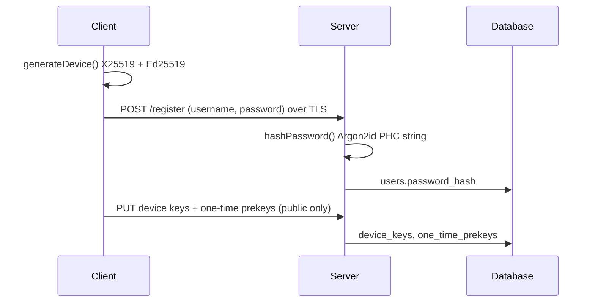
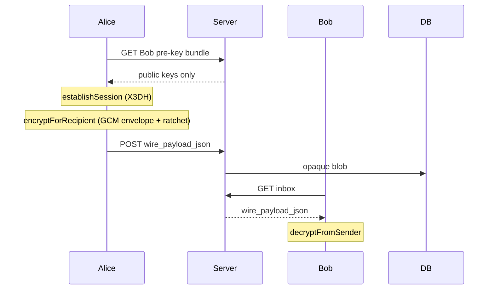

# Cryptographic design (CS4455)

Team **kfc**. Code in `cryptography/` (`@epic-messaging/cryptography`).

**Submission (Word):** [Cryptographic-Design-kfc.docx](./Cryptographic-Design-kfc.docx) — `python docs/scripts/build_crypto_design_docx.py`

Markdown copy below. Related: [threat-model.md](./threat-model.md), [backend-crypto-integration.md](./backend-crypto-integration.md), [architecture.md](./architecture.md).

---

## 1. Goals

The messaging app must give **confidentiality**, **integrity**, and **authenticity** for message bodies between users. The server stores ciphertext and public keys only. It must not be able to read plaintext or change ciphertext without the recipient noticing.

Passwords must survive a database leak. Long-term private keys on disk must not be readable without the user's passphrase.

---

## 2. Threat model

We use the four attacker classes from the CS4455 brief.

| Class | What they can do |
|-------|------------------|
| **A. Passive network** | Read traffic between client and server |
| **B. Active network** | Read, modify, drop, replay, or inject traffic |
| **C. Honest-but-curious server** | Runs our API correctly but logs everything it sees |
| **D. Compromised server** | Full database access and arbitrary API responses |

### Cryptographic defences by attacker

| Defence | A | B | C | D |
|---------|---|---|---|---|
| Past ciphertext stays confidential | Yes | Yes | Yes | Yes* |
| Ciphertext tampering detected | n/a | Yes | Yes | Yes |
| Sender bound to published keys | n/a | Yes | Yes | Yes** |
| Forward secrecy after chain advance | Yes | Yes | Yes | Yes |

\*Server never held private keys.  
\**Signed pre-keys plus TOFU (`/trust`); not a full PKI.

### Out of scope

| Topic | Status | Notes |
|-------|--------|-------|
| Metadata privacy | Not provided | Relay server sees participants and timing |
| Guaranteed delivery | Not provided | Malicious server can drop messages |
| First-contact MITM | Mitigated by TOFU | User pins identity before send |

### What a compromised server (D) can still do

- Refuse to deliver messages or delete rows (availability / delivery, not confidentiality of old ciphertext).
- Serve a fake pre-key bundle to a **new** conversation (MITM) unless the client pins the identity key (TOFU).
- Learn metadata: usernames, message times, sizes, who talked to whom.

### What a compromised server cannot do (if clients follow the protocol)

- Decrypt `wire_payload_json` without stealing client keys.
- Forge a valid AEAD ciphertext that decrypts to chosen plaintext without the session keys.
- Undetectably alter anchored Merkle roots already written to Sepolia (separate blockchain module).

---

## 3. Protocol flows

### 3.1 Registration and login



- Password never stored in plaintext. Only a PHC-encoded Argon2id string (see §4.1).
- Private key material stays on the client, optionally wrapped with `encryptPrivateKeyForStorage`.

### 3.2 Key publication

The server holds **public** pre-key bundles (`identityKey`, signed pre-key, one-time pre-keys). Clients fetch a bundle before the first message to a device.

Trust: **TOFU with pinning** (`verifyIdentityTofu`, `pinIdentity`). On first use the user should confirm the identity fingerprint out of band. On `key_changed`, sending stops until the user accepts the new key. We do not run a CA or web-of-trust.

### 3.3 Send and receive (1:1)



**TypeScript package:** `serializeWireMessage` → libsignal-v1 envelope; type 3 then type 1 (PreKeyWhisperMessage / WhisperMessage protobuf in `bodyB64`).

**C++ client:** same outer envelope; inner JSON with X3DH on each message today (no persisted ratchet yet; see `client/README.md`).

Server validation is structural only, not decryption.

### 3.4 Storage at rest (client)

| Secret | Where | Protection |
|--------|-------|------------|
| Password | Server DB | Argon2id hash only |
| Identity / pre-key private keys | Client disk | `deriveKeys` + AES-256-GCM via `encryptPrivateKeyForStorage` |
| Ratchet session state | Client memory / local store | Not in Postgres |

HKDF labels separate purposes: `epic-messaging/v1/local-storage-key` vs `epic-messaging/v1/session-key` (see `cryptoEngine.ts`).

---

## 4. Primitives and parameters

Standard libraries only: Node `crypto`, `argon2`, and `@privacyresearch/libsignal-protocol-typescript` for X3DH and the double ratchet. No hand-rolled AES, Argon2, or ratchet math.

### 4.1 Password hashing: Argon2id

| Parameter | Value | Source |
|-----------|-------|--------|
| Type | Argon2id | RFC 9106; resists side-channel and GPU cracking |
| memoryCost | 65536 KiB (64 MiB) | OWASP Password Storage Cheat Sheet (2024), "strong" interactive tier |
| timeCost | 3 | Same |
| parallelism | 4 | Same |
| hashLength | 32 bytes | Matches AES-256 key size for downstream KDF input |

Registration returns a PHC-encoded string stored in `users.password_hash`. Verification uses `argon2.verify` on the stored string.

### 4.2 HKDF-SHA256

| Use | salt | info string |
|-----|------|-------------|
| Split master secret into storage + session keys | Per-user random salt (≥8 bytes) | `epic-messaging/v1/local-storage-key` and `epic-messaging/v1/session-key` |

RFC 5869: distinct `info` values give domain separation so the same input key material cannot be swapped between storage encryption and another purpose.

### 4.3 Message payload AEAD: AES-256-GCM

| Parameter | Value | Justification |
|-----------|-------|---------------|
| Key | 256 bits | NIST SP 800-57: 256-bit symmetric keys target 128-bit security under Grover |
| IV / nonce | 96 bits (12 bytes), random per encryption | NIST SP 800-38D: must be unique per key; reuse breaks confidentiality and integrity |
| Tag | 128 bits | Default GCM authentication tag |

Used in `encryptMessage` / `decryptMessage` and in the outer envelope before bytes enter the Signal session cipher.

The privacyresearch port uses AES-CBC + HMAC inside the ratchet transport. `encryptForRecipient` wraps user plaintext in a GCM envelope (AAD: `epic-messaging/libsignal-v1/aead-envelope`) before `SessionCipher.encrypt`.

### 4.4 Key agreement and signing

| Role | Algorithm | Notes |
|------|-----------|-------|
| DH / KEM-style agreement | X25519 | RFC 7748; 32-byte keys; used in X3DH and DH ratchet steps |
| Signatures on signed pre-keys | Ed25519 | RFC 8032; proves possession of identity key |

### 4.5 Session setup: X3DH (not HPKE byte-for-byte)

The brief cites HPKE Mode_Auth (RFC 9180) as an example. We implement **X3DH** from the Signal specification because it matches async messaging with pre-key bundles on the server.

| Topic | Our choice |
|-------|------------|
| Offline recipient | One-time pre-keys uploaded to server |
| Authenticated setup | Signed pre-key + Ed25519 signature over pre-key |
| Shared secret | X3DH DH outputs combined per Signal X3DH spec |
| Forward secrecy | Double ratchet after setup |

HPKE and X3DH solve the same architectural role (authenticated key establishment without giving the server the message keys). A future refactor could expose the same X25519 keys through `hpke-js`; the trust model would stay TOFU.

References: Signal "X3DH Key Agreement Protocol" (2016); Signal "Double Ratchet Algorithm" (2016); simplified to the fields we store in `storageSchema.ts`.

### 4.6 Nonce strategy

- GCM: fresh 12-byte IV from `crypto.randomBytes` on every `encryptMessage` call.
- Ratchet: new message key per message from the double ratchet chain.

**Consequence of nonce reuse under the same key:** GCM leaks the XOR of plaintexts and forgeries become possible. We avoid reuse by random IVs and ratchet-derived keys.

---

## 5. Code layout

### `cryptoEngine.ts` (primitives)

| API | Use |
|-----|-----|
| `hashPassword` / `verifyPassword` | Server registration and login |
| `deriveKeys` | HKDF split for local key encryption |
| `encryptMessage` / `decryptMessage` | AES-256-GCM (+ optional AAD) |
| `generateKeyPair` | X25519 + Ed25519 at registration |
| `encryptPrivateKeyForStorage` | Wrap private key blobs on disk |

### `signal/` (E2EE sessions)

| Piece | Implementation |
|-------|----------------|
| X3DH + double ratchet | `@privacyresearch/libsignal-protocol-typescript` |
| Wire envelope | `libsignal-v1` JSON |
| TOFU | `verifyIdentityTofu` / `pinIdentity` (our code) |

Example imports:

```typescript
import {
  generateDevice,
  deviceToPublicBundle,
  establishSession,
  encryptForRecipient,
  decryptFromSender,
  serializeWireMessage,
  verifyIdentityTofu,
  pinIdentity,
} from "@epic-messaging/cryptography";
```

Smoke test: `cd cryptography && npm run smoke:signal`. Full backend round-trip: `npm run e2e:backend`.

---

## 6. Differences from production Signal

| Production Signal | This project |
|-------------------|--------------|
| `@signalapp/libsignal-client` | TypeScript port for Node and demos |
| PQXDH (Kyber) optional | Classical X25519 only; `kyber_prekey_*` columns reserved |
| AES-CBC + HMAC in transport | GCM envelope around user payload |

Migration path: official libsignal client for C++ and Node when the team needs PQXDH and audit parity.

---

## 7. Post-quantum note

AES-256 remains a reasonable symmetric choice if Grover-style attacks are considered (effective strength about 128 bits). X25519 and Ed25519 are **not** post-quantum. Recorded ciphertext could be decrypted in future if session keys are ever broken by a large quantum computer. Signal's PQXDH (Kyber) is not enabled here.

---

## 8. Blockchain (integrity only)

E2EE keys are unrelated to on-chain anchoring. The `blockchain/` module hashes conversation content with **keccak256**, stores a Merkle root on Sepolia, and verifies single messages via Merkle proofs. See [blockchain/GUIDE.md](../blockchain/GUIDE.md).

On-chain digests are **public**. Anchoring proves "this hash was recorded at time T", not secrecy of the message.

---

## 9. Known limitations

- No full PKI: first-message MITM if users skip TOFU verification.
- Metadata (participants, timing, sizes) visible to server and network observer.
- No message revocation cryptography in this package (policy feature would be app-layer).
- TypeScript port is less audited than official libsignal.
- C++ client: OpenSSL X3DH+GCM per message; persisted double ratchet is a planned step (client README).
- C++ and TypeScript inner payloads are not interoperable without a shared adapter.
- Blockchain anchoring is manual / script-driven in demos; full product integration may lag E2EE.

---

## 10. Validation performed

| Check | Command |
|-------|---------|
| Local E2EE round-trip | `cd cryptography && npm run smoke:signal` |
| HTTP relay with backend | `npm run e2e:backend` (API + Postgres running) |
| Wire JSON accepted by server | `pytest` on `test_wire_payload_validation.py` |

Record exact pass/fail in your cover document before submission; do not claim tests you did not run.
