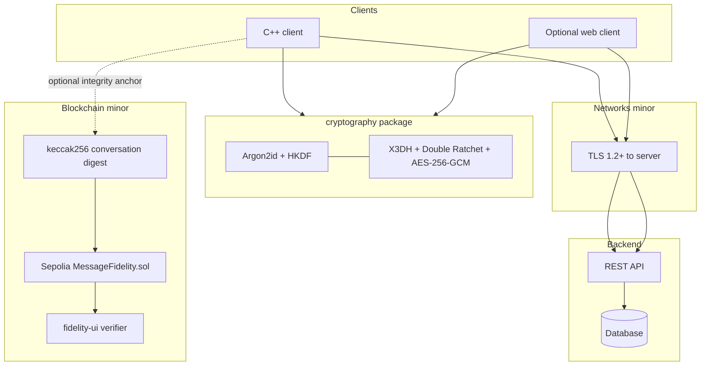
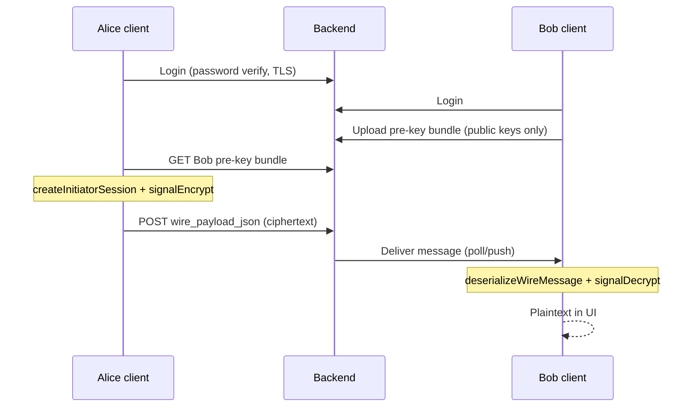

# System architecture

## High-level view

## Security layers (do not merge in explanations)

| Layer | Protects against | Does *not* hide |
|-------|------------------|-----------------|
| **TLS** | Network eavesdropping/tampering on the wire to your VM | Content from the server operator |
| **E2EE** (`cryptography/signal`) | Server reading or forging message plaintext | Metadata (who, when, sizes), ciphertext blobs |
| **Blockchain digest** | Undetected change to an anchored conversation hash | Message content (hash is public on Sepolia) |

## End-to-end message flow

## Module ownership (CS4455)

| Minor | Owner focus | Repo path |
|-------|-------------|-----------|
| Cryptography | E2EE, passwords, key derivation, TOFU | `cryptography/` |
| Blockchain | On-chain digest + verification UI | `blockchain/` |
| Networks | TLS, server hardening, pentest | Backend + deployment |
| C++ | Client UI, local store, crypto *usage* | TBD |
