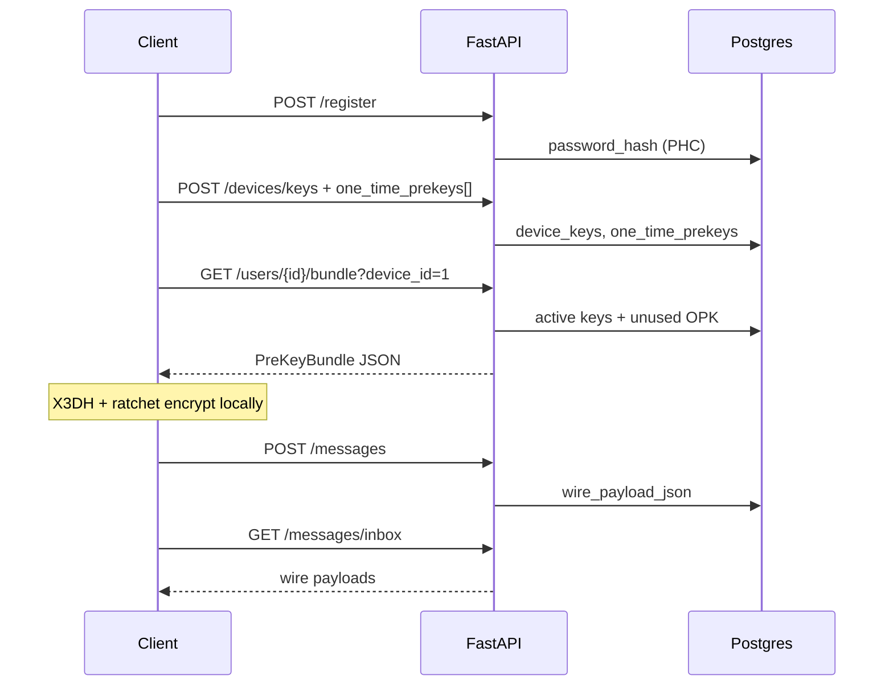

# Backend integration guide — `cryptography/` package

How to wire the FastAPI / Postgres backend to the Epic Messaging crypto module (X3DH, double ratchet, Argon2id, local key encryption). The backend is a **relay**: it stores public keys and opaque ciphertext blobs; it never holds private keys or ratchet state.

**Canonical types:** `cryptography/src/storageSchema.ts`  
**Related docs:** [database.md](./database.md), [integration.md](./integration.md), [architecture.md](./architecture.md)

---

## Principles

| Rule | Backend responsibility |
|------|------------------------|
| Passwords | Store only `hashPassword().hash` (PHC Argon2id string). Never store plaintext. |
| Message bodies | Store only `wire_payload_json` from `serializeWireMessage(...)`. Never decrypt on server. |
| Keys | Store **public** pre-key bundle fields only. Private keys stay on the client (`encryptPrivateKeyForStorage`). |
| TOFU | Runs on the **client** (`verifyIdentityTofu` / `pinIdentity`). Server does not implement trust pinning. |
| Blockchain | Separate from E2EE. Store anchor metadata in SQL; digests are **keccak256** on Sepolia via `MessageFidelity.sol`. |

Build the crypto package before integrating:

```bash
cd cryptography
npm install
npm run build
```

---

## What to keep vs change in the existing backend schema

Daniel’s branch already has useful infrastructure (`users`, `refresh_sessions`, `audit_logs`, `conversations`, `blockchain_anchors`). To work with this crypto module, **add or migrate** the tables below. Tables built for a different E2EE model (`user_key_bundles`, `messages` with `nonce`/`encrypted_payload`, `message_recipients` with `encrypted_message_key`) should be **replaced or sidelined** — they do not match the Signal wire format.

| Keep (backend infra) | Add / align (crypto contract) |
|----------------------|-------------------------------|
| `users` (+ `password_hash`) | `device_keys` |
| `refresh_sessions`, `audit_logs` | `one_time_prekeys` |
| `conversations`, `conversation_members` (optional UI/metadata) | `messages` with `wire_payload_json` |
| `blockchain_anchors` (extend conventions below) | — |

Do **not** maintain a second copy of `cryptography/` inside the backend repo. Use the monorepo package at `../cryptography`.

---

## Target database tables

Mirror `storageSchema.ts`. Suggested PostgreSQL shapes (UUIDs match existing backend style):

### `users`

| Column | Type | Notes |
|--------|------|--------|
| `id` | UUID PK | |
| `username`, `email` | text | Your existing auth fields |
| `password_hash` | varchar(255) | PHC string from `hashPassword()` — salt is embedded |

### `device_keys`

One row per `(user_id, device_id)`. Public material only.

| Column | Type | Maps from `buildPreKeyBundle()` |
|--------|------|----------------------------------|
| `user_id` | UUID FK | |
| `device_id` | int | `deviceId` |
| `registration_id` | int | `registrationId` |
| `identity_key_public_b64` | text | `identityKey` (standard base64) |
| `identity_signing_public_b64` | text | `identitySigningKey` |
| `signed_prekey_id` | int | `signedPreKeyId` |
| `signed_prekey_public_b64` | text | `signedPreKey` |
| `signed_prekey_signature_b64` | text | `signedPreKeySignature` |
| `signed_prekey_created_at` | timestamptz | Set on upload |

Unique constraint: `(user_id, device_id)`.

### `one_time_prekeys`

| Column | Type | Notes |
|--------|------|--------|
| `user_id`, `device_id` | | |
| `prekey_id` | int | |
| `prekey_public_b64` | text | |
| `used_at` | timestamptz nullable | Set when consumed |

Unique: `(user_id, device_id, prekey_id)`. Index `(user_id, device_id)` where `used_at IS NULL` for bundle fetch.

### `messages`

| Column | Type | Notes |
|--------|------|--------|
| `message_id` | UUID PK | |
| `sender_user_id`, `sender_device_id` | | |
| `recipient_user_id`, `recipient_device_id` | | Inbox query index on recipient |
| `wire_payload_json` | text / jsonb | Opaque — see wire format below |
| `created_at` | timestamptz | |

Optional non-secret columns (from `MessageMetadata`): `conversation_id`, `consumed_one_time_prekey_id` for housekeeping.

**Do not** split ratchet fields into `nonce` / `encrypted_payload` on the server — clients send one JSON blob.

---

## Wire payload format

Clients POST the string returned by `serializeWireMessage()`. The server stores it verbatim. Shape (`StoredWireMessage`):

```json
{
  "counter": 0,
  "previousCounter": 0,
  "ciphertext": "<base64>",
  "iv": "<base64>",
  "authTag": "<base64>",
  "ratchetPublicKey": "<base64, optional>",
  "x3dh": {
    "identityKey": "<base64>",
    "ephemeralKey": "<base64>"
  }
}
```

Validation on the server should be **structural only** (required keys present, base64 decodable) — not decryption.

---

## Password hashing (Python ↔ TypeScript)

The crypto package uses **Argon2id** and returns a PHC-encoded string:

```ts
import { hashPassword, verifyPassword } from "@epic-messaging/cryptography";

const { hash } = await hashPassword(plainPassword);
// Store `hash` in users.password_hash

const ok = await verifyPassword(plainPassword, storedHash);
```

**Option A — Python only (recommended for FastAPI):** use `argon2-cffi` with the same PHC strings (already in `requirements.txt`):

```python
from argon2 import PasswordHasher
from argon2.exceptions import VerifyMismatchError

ph = PasswordHasher()  # defaults differ — for verify-only, use:

from argon2.low_level import Type
import argon2

def verify_password(plain: str, stored_hash: str) -> bool:
    try:
        return argon2.PasswordHasher().verify(stored_hash, plain)
    except VerifyMismatchError:
        return False
```

For **registration**, either call Node once (`hashPassword`) or configure `argon2-cffi` to match `cryptoEngine.ts` (`memory_cost=65536`, `time_cost=3`, `parallelism=4`, `hash_len=32`, type Argon2id). Easiest path: small Node script or subprocess on register only.

**Option B — Node helper:** `"@epic-messaging/cryptography": "file:../cryptography"` and invoke `hashPassword` / `verifyPassword` from a thin Node service or CLI.

Never log passwords or hashes in application logs.

---

## REST API (minimum viable)

Implement these before group chat or blockchain automation. All traffic over **TLS** in production.



| Method | Path | Body / behaviour |
|--------|------|------------------|
| `POST` | `/api/v1/register` | `username`, `password` → `hashPassword` → insert `users` |
| `POST` | `/api/v1/login` | `verifyPassword` → issue session/JWT (your existing `refresh_sessions` pattern) |
| `PUT` | `/api/v1/devices/{device_id}/keys` | Public fields from `DeviceKeysRow` |
| `POST` | `/api/v1/devices/{device_id}/one-time-prekeys` | Batch `{ prekey_id, prekey_public_b64 }[]` |
| `GET` | `/api/v1/users/{user_id}/bundle` | Query `device_id` → merge `device_keys` + one unused OPK → JSON matching `PreKeyBundle` |
| `POST` | `/api/v1/messages` | `sender_*`, `recipient_*`, `wire_payload_json`; optional `consumed_one_time_prekey_id` → set `one_time_prekeys.used_at` |
| `GET` | `/api/v1/messages/inbox` | Filter by authenticated `recipient_user_id` (+ `device_id`) |

**Bundle GET example response** (public keys only):

```json
{
  "registrationId": 12345,
  "deviceId": 1,
  "identityKey": "<base64>",
  "identitySigningKey": "<base64>",
  "signedPreKeyId": 1,
  "signedPreKey": "<base64>",
  "signedPreKeySignature": "<base64>",
  "oneTimePreKeyId": 42,
  "oneTimePreKey": "<base64>"
}
```

Field names can be camelCase in JSON if documented; DB columns follow `storageSchema.ts` snake_case.

---

## Client-side crypto flow (what the server enables)

The server does not call Signal APIs. Clients do:

1. **Register / login** — password via API only.
2. **Generate keys** — `generateKeyPair()`, `buildPreKeyBundle()`, upload public parts.
3. **First message to a contact** — `GET` bundle → `createInitiatorSession` → `signalEncrypt` → `serializeWireMessage` → `POST /messages` with `consumed_one_time_prekey_id` if returned.
4. **Reply** — `signalDecrypt` / `signalEncrypt` with local ratchet state → POST next wire payload.
5. **TOFU** — before trusting a bundle, `verifyIdentityTofu`; on `key_changed`, reject send.

Ratchet state and encrypted private keys: **local files only** (`encryptPrivateKeyForStorage`).

---

## Mapping away from the alternate schema

If the current migration uses `user_key_bundles` / split `messages` columns / `message_recipients.encrypted_message_key`, migrate as follows:

| Old concept | New approach |
|-------------|--------------|
| `user_key_bundles` | `device_keys` + `one_time_prekeys` |
| `messages.encrypted_payload`, `nonce`, `signature` | Single `wire_payload_json` |
| `message_recipients.encrypted_message_key` | Not used for 1:1 Signal; ratchet handles per-message keys on device |
| `messages.algorithm` / `encryption_scheme` | Optional constant metadata: `AES-256-GCM` inside ratchet only |

`conversations` can remain for threading in the UI; link `conversation_id` on `messages` as optional metadata without changing crypto.

---

## Blockchain table (`blockchain_anchors`)

E2EE and anchoring are independent. When a client or job anchors a digest:

| Column | Convention |
|--------|------------|
| `digest` | `0x` + 64 hex chars = keccak256 of canonical conversation bytes |
| `chain` | `sepolia` |
| `contract_address` | Deployed `MessageFidelity` address |
| `transaction_hash` | Sepolia tx from `storeHash(recordId, contentHash)` |
| `status` | e.g. `pending` → `confirmed` |
| `message_id` or `conversation_id` | At least one set (existing check constraint) |

Off-chain: define canonical serialization for “conversation segment” in team docs, then `keccak256(canonicalBytes)`. On-chain: `recordId` = `bytes32` (e.g. `ethers.id(label)`). See `blockchain/scripts/anchor.ts` and `blockchain/README.md`.

Optional additions: `digest_algorithm` default `keccak256`, `block_number`, `anchored_at` from receipt.

---

## Package imports (Node sidecar or tooling)

```json
{
  "dependencies": {
    "@epic-messaging/cryptography": "file:../cryptography"
  }
}
```

```ts
import {
  hashPassword,
  verifyPassword,
  CRYPTO_ALGORITHMS,
} from "@epic-messaging/cryptography";

export {
  buildPreKeyBundle,
  createInitiatorSession,
  signalEncrypt,
  signalDecrypt,
} from "@epic-messaging/cryptography";
```

Export surface: `cryptography/src/index.ts`.

---

## Implementation checklist

- [ ] Alembic migration: `device_keys`, `one_time_prekeys`, `messages.wire_payload_json`
- [ ] Deprecate or drop tables that conflict with Signal relay model
- [ ] `POST /register`, `POST /login` with PHC `password_hash`
- [ ] Key upload + bundle fetch endpoints
- [ ] Message relay + inbox (opaque JSON only)
- [ ] Mark one-time pre-key used on first message
- [ ] `blockchain_anchors`: keccak256 + Sepolia metadata conventions
- [ ] Point all crypto logic at monorepo `cryptography/` (build in CI)
- [ ] Update backend README to reference this guide

---

## References

| File | Purpose |
|------|---------|
| `cryptography/src/storageSchema.ts` | DB column contract |
| `cryptography/src/wireFormat.ts` | Message JSON serialization |
| `cryptography/src/signal/` | X3DH, ratchet, TOFU, pre-keys |
| `cryptography/src/cryptoEngine.ts` | Argon2id, HKDF, AES-GCM helpers |
| `blockchain/contracts/MessageFidelity.sol` | On-chain digest storage |
| `docs/database.md` | ER diagram and table notes |

Questions on wire format, bundle fields, or anchoring: crypto / blockchain module.
