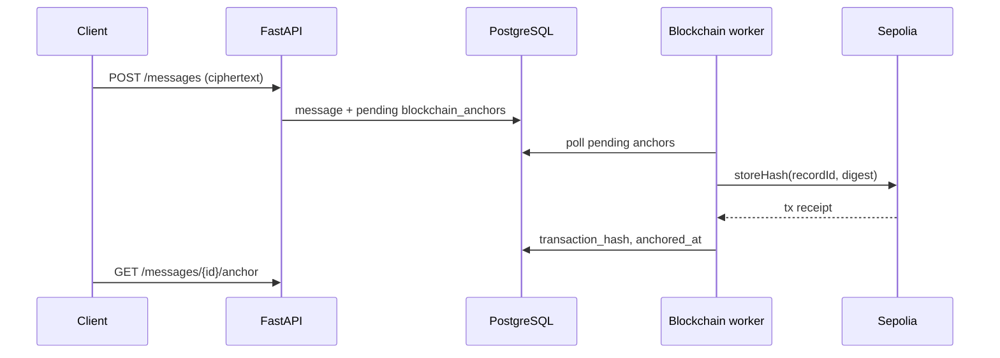

# Blockchain design (CS4455)

Team **kfc**. Contract source: [`blockchain/contracts/MessageFidelity.sol`](../../blockchain/contracts/MessageFidelity.sol).

## Purpose

The messaging app already protects confidentiality with E2EE. The blockchain piece adds **tamper-evident integrity**: if someone changes an anchored record after the fact, recomputing the digest should no longer match what Sepolia stored.

The chain does not encrypt messages. Hashes on a public testnet are visible to anyone with the contract address.

## Brief mapping

| Requirement | How we meet it |
|-------------|----------------|
| Solidity contract, `keccak256`, timestamp | `MessageFidelity.storeHash(recordId, contentHash)` stores root/hash and `block.timestamp` |
| Deploy to Sepolia | `npm run deploy:sepolia`; address in `fidelity-ui/deployment.json` |
| Address and ABI in submission | `deployment.json`, `fidelity-ui/MessageFidelity.abi.json`, Hardhat `artifacts/` |
| Digest on send, tx hash stored | Backend creates pending row on send; worker submits tx and saves `transaction_hash` |
| Verification page, pass/fail | `blockchain/fidelity-ui/` — independent static UI |
| Explain hashing, gas, immutability | Sections below |

## On-chain vs off-chain

| On-chain (Sepolia) | Off-chain |
|--------------------|-----------|
| `bytes32` digest per `recordId` | Ciphertext (`wire_payload_json`), plaintext (client only) |
| Anchor timestamp | Full message rows, Merkle siblings for batch proofs |
| `transactionHash` in `blockchain_anchors` | User ids, device ids, API metadata |

Plaintext is never sent to the contract.

## Why keccak256

Ethereum and Solidity use **Keccak-256** as the standard 32-byte hash (`keccak256` in Solidity, `ethers.keccak256` / `eth_hash` in our tooling). Using the same function off-chain and on-chain avoids encoding mismatches. SHA-256 would not match native EVM helpers without extra adapters.

## Two anchoring paths (same contract)

We use one contract (`storeHash`) but two digest workflows, which matches the brief’s allowance for **per-message** or **conversation segment** anchoring.

### 1. Integrated backend (production demo)

When a message is sent, the API creates a pending anchor:

- **Record id:** `keccak256("message:" + message_uuid)` (see `server/backend/app/core/blockchain_hashing.py`).
- **Digest:** `keccak256` of a canonical JSON object containing ids, devices, timestamps, and `wire_payload_json` (sorted keys, no plaintext).

The **blockchain worker** (`server/backend/app/workers/blockchain_worker.py`) signs `storeHash(recordId, digest)` with the contract owner key and updates the row with `transaction_hash` and `anchored_at`.

**Trade-off:** one Sepolia transaction per anchored message. Simple to explain and ties directly to each send. Gas cost scales with message volume.

Clients read status via `GET /api/v1/messages/{id}/anchor` and can call `POST /api/v1/blockchain/verify` against stored metadata.

### 2. Merkle conversation batch (`blockchain/` package)

For batch demos and the standalone verifier, messages are ordered by `createdAt` then `messageId`, hashed into leaves `keccak256(messageId, keccak256(plaintext))`, combined into a binary Merkle tree, and the **root** is stored under a conversation `recordId` (optionally segmented — see `blockchain/GUIDE.md`).

**Trade-off:** one transaction covers many messages; verifying one leaf needs the ordered list (or stored proof) off-chain.

## Smart contract behaviour

Current `MessageFidelity.sol` (owner-write-once):

- Only `owner` may call `storeHash`.
- Each `recordId` can be written once; a second write reverts (`RecordAlreadyAnchored`).
- `getHash(recordId)` returns stored digest and timestamp.
- `verifyMessageInHistory` checks a Merkle proof against the stored root.

Deployed metadata (address, deployer, version) is in `blockchain/fidelity-ui/deployment.json`. ABI copy for submission: `blockchain/fidelity-ui/MessageFidelity.abi.json`.

## Verification page

`blockchain/fidelity-ui/` is a small static site (serve with `npm run serve:fidelity`).

User supplies RPC URL, contract address (or loads `deployment.json`), participant user ids, a JSON array of messages, and the message id to check. The page recomputes the Merkle leaf and proof, reads the on-chain root, and shows **pass** or **fail** with the anchor timestamp.

It runs without the FastAPI server. The Merkle path matches the `blockchain/` npm package and `MessageFidelity.sol` proof verification.

## End-to-end flow (integrated app)

## Interview notes

**Hash function:** Keccak-256 binds record ids and content digests in a way the EVM can reproduce.

**Transaction:** Owner wallet signs `storeHash`; miners include it; receipt gives `transactionHash` for later lookup on Etherscan.

**Gas:** Each `storeHash` is a state-changing call; cost depends on Sepolia congestion. Test ETH from a faucet is enough for demos.

**Immutability:** Past blocks are costly to rewrite; you rely on Ethereum consensus. Write-once per `recordId` stops the owner from replacing an anchor in place (after redeploy to hardened contract).

**Limits:** Public hashes; no proof of who sent a message (that is E2EE/signatures); wrong canonical JSON or message order breaks verification; anchoring is asynchronous via the worker.

## Related files

| Path | Role |
|------|------|
| `blockchain/contracts/MessageFidelity.sol` | On-chain storage and Merkle verify |
| `blockchain/src/merkle.ts`, `conversation.ts` | Off-chain tree (matches Solidity) |
| `server/backend/app/core/blockchain_hashing.py` | Per-message digest for API |
| `server/backend/app/workers/blockchain_worker.py` | Sepolia submission |
| `blockchain/fidelity-ui/` | Standalone verifier UI |
