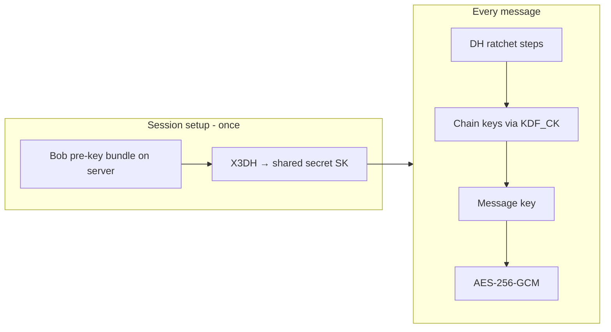

# Cryptography module

Package: `cryptography/` (`@epic-messaging/cryptography`).

## Two layers

### 1. `cryptoEngine.ts` — primitives (server + client)

| API | Use |
|-----|-----|
| `hashPassword` / `verifyPassword` | Server registration/login only |
| `deriveKeys` | Split one master secret → storage key + session key (HKDF, separate `info`) |
| `encryptMessage` / `decryptMessage` | AES-256-GCM (+ optional AAD) |
| `generateKeyPair` | X25519 (DH) + Ed25519 (signing) at registration |
| `encryptPrivateKeyForStorage` | Wrap identity/pre-key private material on disk |

Uses **Node `crypto`** and **`argon2`** — not custom implementations of AES or Argon2.

### 2. `signal/` — E2EE sessions

| Piece | Spec basis |
|-------|------------|
| X3DH | [Signal X3DH](https://signal.org/docs/specifications/x3dh/) |
| Double Ratchet | [Signal Double Ratchet](https://signal.org/docs/specifications/doubleratchet/) |
| Payload cipher | **AES-256-GCM** (CS4455 AEAD rule; Signal uses AES-CBC+HMAC) |

High-level API:

```typescript
import {
  buildPreKeyBundle,
  createInitiatorSession,
  createResponderSession,
  signalEncrypt,
  signalDecrypt,
  serializeWireMessage,
  deserializeWireMessage,
} from "@epic-messaging/cryptography";
```

## X3DH + ratchet (conceptual)



- **X** in X3DH = **extended** (signed + one-time pre-keys for offline recipients).
- **Double ratchet** = symmetric chain ratchet + periodic DH ratchet (forward secrecy).

## Wire format

Store/transmit messages with `serializeWireMessage` → JSON with base64 fields.  
Types: `storageSchema.ts`, `wireFormat.ts`.

## Algorithm choices (design doc)

| Choice | Why |
|--------|-----|
| Argon2id, 64 MiB, t=3, p=4 | OWASP-aligned memory-hard password hashing |
| HKDF-SHA256 + `info` labels | Domain separation (storage vs session keys) |
| AES-256-GCM | Brief-mandated AEAD; 256-bit keys ≈ 128-bit strength under Grover |
| X25519 | Signal / HPKE-style DH; 32-byte keys easy for C++ FFI |
| Ed25519 | Sign signed pre-keys; sender authenticity |
| X3DH not HPKE byte-for-byte | Async pre-key bundles match messaging model; HPKE is equivalent *role* |

## Post-quantum honesty

- **AES-256**: acceptable symmetric layer for PQ threat models (with Grover caveat).
- **X25519 / Ed25519**: **not** post-quantum; PQXDH would be needed for PQ session setup (Signal roadmap).

## Known gap vs production Signal

Ratchet **state machine** is maintained in this repo, not **libsignal**. Fine for CS4455 with spec citations and documented limitations; production would prefer audited libsignal for the protocol layer.
