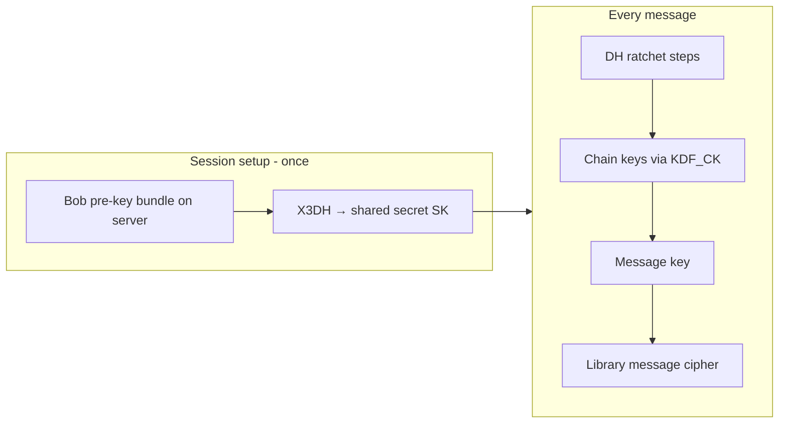

# Cryptography module

Package: `cryptography/` (`@epic-messaging/cryptography`).

## Library-first policy

**Default:** use a standard, audited library for anything security-critical.

| Area | Preferred | Current repo |
|------|-----------|--------------|
| Password hashing | `argon2` | `argon2` |
| HKDF, AES-GCM, X25519, Ed25519 | Node `crypto` | Node `crypto` |
| E2EE session (X3DH + ratchet) | `@signalapp/libsignal-client` or maintained TS port | `@privacyresearch/libsignal-protocol-typescript` via `signal/` |
| HPKE (if required literally) | `hpke-js` / `@hpke/core` | X3DH used for same role |
| C++ client | OpenSSL 3 / libsodium | Team to align with wire format |

**In this repo:** session setup and ratcheting are delegated to the TS port. **We keep:** Argon2 / HKDF / at-rest GCM (`cryptoEngine.ts`), wire format + DB types, TOFU helpers. **We do not** maintain a hand-rolled double ratchet.

**Cipher note:** the privacyresearch port uses Signal’s default **AES-256-CBC + HMAC** for transport internals. To keep CS4455 AEAD compliance, `encryptForRecipient` wraps the user message payload in an explicit **AES-256-GCM** envelope before passing bytes into the ratchet.

## Two layers

### 1. `cryptoEngine.ts` — primitives (server + client)

| API | Use |
|-----|-----|
| `hashPassword` / `verifyPassword` | Server registration/login only |
| `deriveKeys` | Split one master secret → storage key + session key (HKDF, separate `info`) |
| `encryptMessage` / `decryptMessage` | AES-256-GCM (+ optional AAD) |
| `generateKeyPair` | X25519 (DH) + Ed25519 (signing) at registration |
| `encryptPrivateKeyForStorage` | Wrap identity/pre-key private material on disk |

Uses **Node `crypto`** and **`argon2`** — not custom implementations of AES or Argon2.

### 2. `signal/` — E2EE sessions (library-backed)

| Piece | Implementation |
|-------|----------------|
| X3DH + Double Ratchet | `@privacyresearch/libsignal-protocol-typescript` |
| Wire envelope | `libsignal-v1` JSON (`LibSignalWireMessage`) |
| TOFU | `verifyIdentityTofu` / `pinIdentity` (our code) |

High-level API:

```typescript
import {
  generateDevice,
  deviceToPublicBundle,
  establishSession,
  encryptForRecipient,
  decryptFromSender,
  serializeWireMessage,
  deserializeWireMessage,
  verifyIdentityTofu,
  pinIdentity,
} from "@epic-messaging/cryptography";
```

Smoke test: `cd cryptography && npm run smoke:signal`.

## X3DH + ratchet (conceptual)



- **X** in X3DH = **extended** (signed + one-time pre-keys for offline recipients).
- **Double ratchet** = symmetric chain ratchet + periodic DH ratchet (forward secrecy).

## Wire format

Store/transmit messages with `serializeWireMessage` → JSON with base64 fields.  
Types: `storageSchema.ts`, `wireFormat.ts`.

## Algorithm choices (design doc)

| Choice | Why |
|--------|-----|
| Argon2id, 64 MiB, t=3, p=4 | OWASP-aligned memory-hard password hashing |
| HKDF-SHA256 + `info` labels | Domain separation (storage vs session keys) |
| AES-256-GCM | Brief-mandated AEAD; 256-bit keys ≈ 128-bit strength under Grover |
| X25519 | Signal / HPKE-style DH; 32-byte keys easy for C++ FFI |
| Ed25519 | Sign signed pre-keys; sender authenticity |
| X3DH not HPKE byte-for-byte | Async pre-key bundles match messaging model; HPKE is equivalent *role* |

## Post-quantum honesty

- **AES-256**: acceptable symmetric layer for PQ threat models (with Grover caveat).
- **X25519 / Ed25519**: **not** post-quantum; PQXDH would be needed for PQ session setup (Signal roadmap).

## Future: `@signalapp/libsignal-client`

Official libsignal adds **PQXDH (Kyber)** and matches production Signal. `DeviceKeysRow` reserves optional `kyber_prekey_*` columns for that migration. Classic X3DH in the current port does not populate them.
