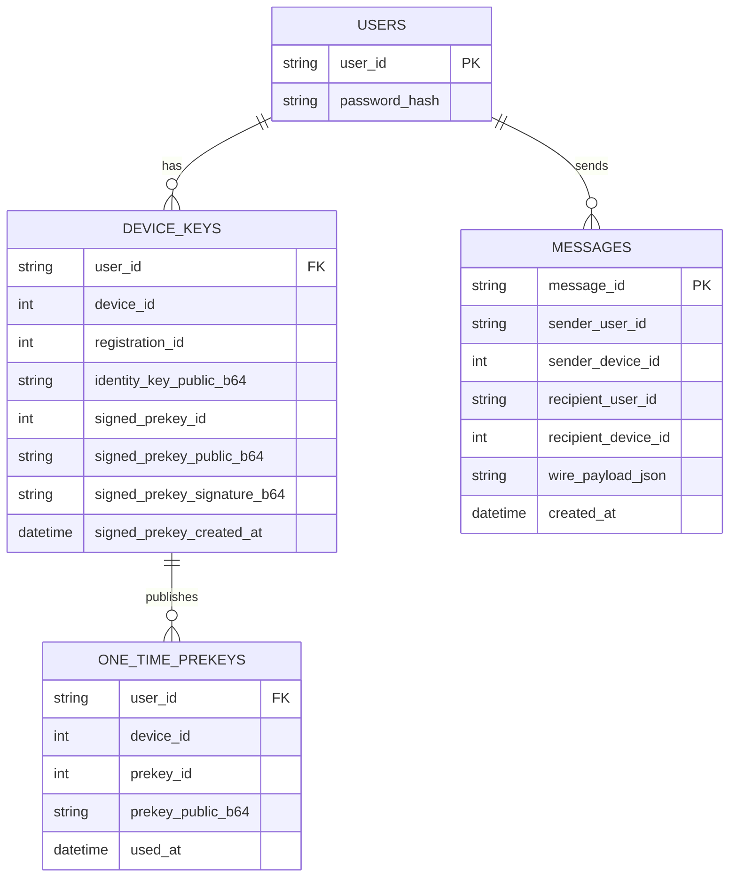

# Database schema (crypto-related)

Types are defined in `cryptography/src/storageSchema.ts`.  
**Private keys and ratchet state never go in the database.**

## Entity diagram

## Table notes

### `users`

| Column | Source |
|--------|--------|
| `password_hash` | `hashPassword().hash` (PHC string; salt is inside it) |

Do **not** store plaintext passwords. A separate `salt` column is optional (redundant with PHC).

### `device_keys`

Populated when the client calls `deviceToPublicBundle()` / `deviceToDbRows()` and uploads **public** fields only. Identity key doubles as signing key in the libsignal-protocol port (no separate `identity_signing_*` column).

Rotate `signed_prekey_*` periodically; old clients may need a bundle refresh.

### `one_time_prekeys`

- Insert many rows per device (batch upload).
- When the first `PreKeyWhisperMessage` is consumed (`wire.type === 3`), set `used_at` on the OPK row (client removes locally via `InMemoryProtocolStore.removePreKey`).

### `messages`

| Column | Content |
|--------|---------|
| `wire_payload_json` | Output of `serializeWireMessage(encryptForRecipient(...))` — `format: "libsignal-v1"` |

Server cannot decrypt without client private state. Index `recipient_*` for inbox queries.

## Client-only storage (not SQL)

| Data | Location |
|------|----------|
| Identity + pre-key **private** keys | Encrypted file / OS keystore via `encryptPrivateKeyForStorage` |
| Double ratchet state | Per-conversation file or embedded DB on device |
| TOFU trust store | `Map` persisted locally (`verifyIdentityTofu` / `pinIdentity`) |

If ratchet state is lost, the conversation cannot decrypt old messages (unless you add a backup protocol).
