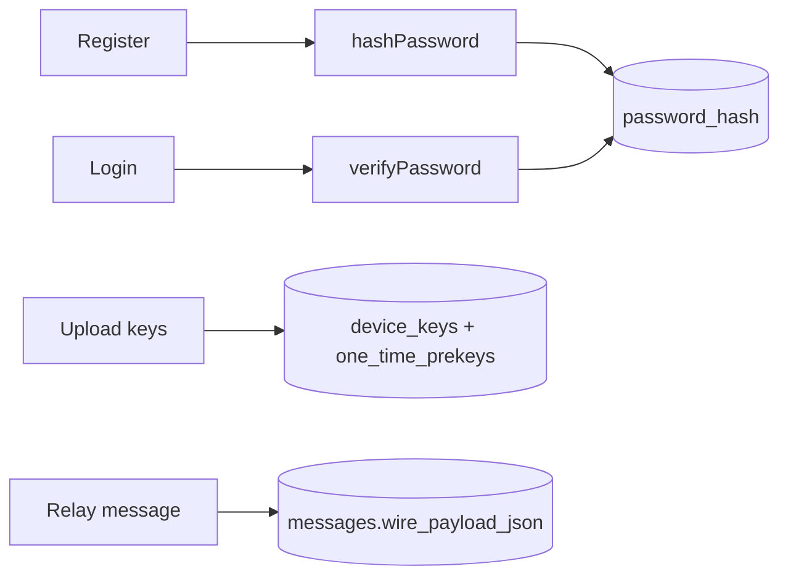
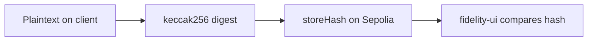

# Integration guide

How each part of the project uses `cryptography/`.

## Backend (Node / Python + Node crypto)



| Endpoint (example) | Crypto calls |
|--------------------|--------------|
| `POST /register` | `hashPassword` → store `hash` |
| `POST /login` | `verifyPassword` |
| `POST /devices/keys` | Store public fields from `PreKeyBundle` |
| `GET /users/:id/bundle` | Return bundle JSON for clients |
| `POST /messages` | Accept `wire_payload_json` opaque blob |
| `POST /messages` (first msg) | Client may send `consumed_one_time_prekey_id` → mark OPK used |

Install:

```bash
cd cryptography && npm run build
```

In backend `package.json`: `"@epic-messaging/cryptography": "file:../cryptography"`.

## C++ client

The npm package is TypeScript. Pick one approach and document it in your README:

| Approach | Pros | Cons |
|----------|------|------|
| **A. Same algorithms in C++** (OpenSSL 3 / libsodium) | Native client; matches brief | Must match wire format and KDF labels exactly |
| **B. Local Node helper** | Reuses this package | Extra process; awkward for grading C++ |
| **C. Crypto only on “send” via backend** | Simple | **Not** E2EE if server encrypts |

Recommended: **A** for E2EE — use this repo as the spec:

1. Generate X25519 / Ed25519 keypairs.
2. Implement or call libs for X3DH + ratchet **or** shell out to Node for v1 demo only.
3. Persist ratchet state + `encryptPrivateKeyForStorage` blobs locally.
4. POST `serializeWireMessage` JSON over **TLS**.

Minimum C++ scope for Memon’s rubric: message compose UI, local history store, validate wire JSON shape, TLS socket to API.

## Optional web client

Web Crypto API can mirror:

- Argon2: use backend-only for passwords (simplest).
- AES-GCM, HKDF, X25519 where supported.
- Or bundle compiled `cryptography/dist` in frontend tooling.

## Blockchain (`blockchain/`)

**Independent of E2EE keys.**



1. Client (or demo script) canonicalizes a **conversation segment** (define format in team README).
2. `keccak256(canonicalBytes)` → `MessageFidelity.storeHash(recordId, contentHash)`.
3. Verification page recomputes hash from pasted content.

Do not put plaintext on-chain. The chain proves **integrity** of whatever digest you anchored, not confidentiality.

See `blockchain/README.md` for deploy and ABI.

## Networks / TLS (Burkley)

- Terminate TLS at `*.THEBURKENATOR.COM`.
- Certificate validation on clients.
- E2EE is **inside** TLS: TLS protects the channel; GCM ciphertext protects content from the server.

## TOFU in the UI

When showing a new contact:

1. `verifyIdentityTofu(store, userId, deviceId, identityKeyFromBundle)`.
2. On `first_use` → show fingerprint → `pinIdentity` after user confirms.
3. On `key_changed` → block or warn before sending.

Without this UI step, a malicious server can substitute keys on **first** contact.
