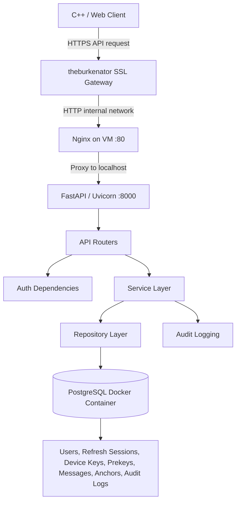

# Backend Architecture

## Purpose

The backend is a FastAPI server for authenticated API interaction and encrypted direct 1:1 message relay.

It authenticates users, validates requests, enforces object-level access control, stores public key material, stores encrypted relay payloads, rotates refresh tokens, and records audit/security events.

It does not decrypt messages, store plaintext messages, store private keys, store Signal ratchet/session state, perform Signal cryptographic operations, support group chats, or submit blockchain transactions.

## Runtime Layers

```text
FastAPI routes
    -> Dependencies / current-user auth / rate limiting
    -> Services
    -> Repositories
    -> Async SQLAlchemy
    -> PostgreSQL
```

| Layer | Files | Responsibility |
| --- | --- | --- |
| App setup | `backend/app/main.py` | Creates FastAPI app, installs CORS, security headers, validation error sanitization, and `/api/v1` router |
| Routes | `backend/app/api/v1/*.py` | HTTP contract, status codes, route-level dependencies, safe public errors |
| Dependencies | `backend/app/api/deps.py` | DB session injection, Bearer token parsing, current-user authentication, rate-limit enforcement |
| Services | `backend/app/services/*.py` | Business workflows for auth, tokens, passwords, messages, and audit logging |
| Repositories | `backend/app/repositories/*.py` | SQLAlchemy query construction and persistence operations |
| Models | `backend/app/models/*.py` | PostgreSQL schema mapped through SQLAlchemy ORM |
| Schemas | `backend/app/schemas/*.py` | Pydantic request/response validation and serialization |
| Migrations | `backend/alembic/*` | Database schema creation and evolution |
| Tests | `backend/tests/*` | Unit, integration, and security evidence |

## Request Flow



## Authentication Flow

1. `POST /api/v1/auth/register` validates username, email, and password.
2. `password_service.hash_password()` stores an Argon2id PHC password hash.
3. `POST /api/v1/auth/login` checks the submitted password against the stored hash.
4. `token_service.create_access_token()` issues a short-lived HS256 JWT access token.
5. `token_service.create_refresh_token()` creates an opaque refresh token.
6. `token_service.hash_refresh_token()` stores only an HMAC-SHA256 refresh-token hash in `refresh_sessions`.
7. `POST /api/v1/auth/refresh` uses row locking to rotate the refresh token and revoke the old session.
8. Protected routes call `get_current_user()`, which validates the Bearer access token and loads an active user from PostgreSQL.

Security-relevant behavior:

- Login failures are generic: `Invalid credentials`.
- Inactive users cannot log in or authenticate with an otherwise valid token.
- Raw refresh tokens cannot be used as Bearer access tokens.
- Refresh-token replay fails after rotation.
- Logout returns success without revealing whether the submitted refresh token existed.

## Public Key Relay Flow

1. The authenticated user uploads public device key material with `PUT /api/v1/keys/devices/{device_id}`.
2. Path `device_id` must match body `device_id`.
3. Public key fields are validated as standard base64.
4. Only public fields are stored: identity public key, identity signing public key, signed prekey, and signed prekey signature.
5. The user uploads public one-time prekeys with `POST /api/v1/keys/devices/{device_id}/one-time-prekeys`.
6. A requester fetches a target user's prekey bundle with `GET /api/v1/keys/users/{user_id}/devices/{device_id}/prekey-bundle`.
7. If an unused one-time prekey exists, the backend marks it used inside the fetch workflow.

The backend never stores private keys or client-side Signal session state.

## Message Relay Flow

1. The authenticated sender posts a direct message to `POST /api/v1/messages`.
2. The request body contains `sender_device_id`, `recipient_user_id`, `recipient_device_id`, optional `consumed_one_time_prekey_id`, and `wire_payload_json`.
3. The sender user ID is taken only from `current_user.id`; `sender_user_id` in the request body is rejected.
4. The service verifies the recipient exists and is active.
5. The service verifies sender and recipient devices are active.
6. If `consumed_one_time_prekey_id` is provided, it must match a prekey already consumed for the recipient user/device.
7. The backend stores `wire_payload_json` as an opaque encrypted payload.
8. Sender/recipient list and fetch routes apply direct object-level access checks.
9. Sender revocation hides the message from the recipient by setting `access_revoked_at`.
10. Sender and recipient deletion are per-user visibility changes, not immediate hard deletion.

The backend validates the wire payload structure but does not decrypt it.

## Database Access Pattern

The backend uses async SQLAlchemy 2.x with `asyncpg`. The database session dependency yields an `AsyncSession` per request. Services own transaction boundaries for business workflows; repositories build SQLAlchemy expressions and do not commit by themselves unless explicitly documented through service calls.

The application refuses to start database sessions unless `DATABASE_URL` is set and uses the `postgresql+asyncpg://` scheme.

## Security Controls

- Argon2id password hashing.
- Short-lived signed JWT access tokens.
- HMAC-hashed refresh tokens with server-side rotation state.
- Generic authentication failure responses.
- Current-user dependency for protected routes.
- Object-level access checks for messages and key ownership.
- Strict Pydantic request models with `extra="forbid"`.
- Base64 and UUID validation for key and path data.
- LibSignal-style `wire_payload_json` structural validation.
- SQLAlchemy ORM expressions instead of string-built SQL.
- Sanitized validation errors that avoid echoing secret inputs.
- Security headers: `X-Content-Type-Options`, `X-Frame-Options`, `Referrer-Policy`, and `Cache-Control`.
- Production CORS rejects wildcard origins.
- Best-effort audit logging with allowlisted details.
- In-memory fixed-window rate limiting.

## Explicit Non-Goals

- No plaintext message storage.
- No message decryption.
- No private key storage.
- No server-side Signal ratchet/session state.
- No group chat or conversation model.
- No blockchain transaction submission route.
- No admin audit-log viewer.
- No distributed rate limiter.
