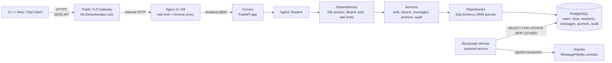
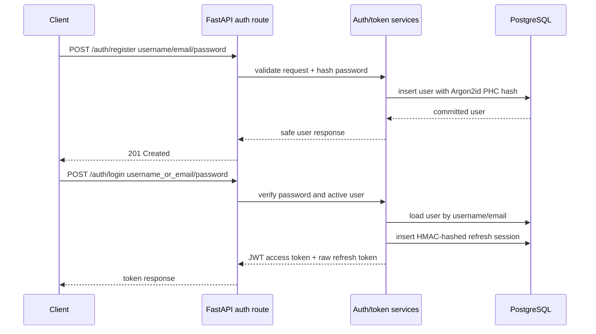
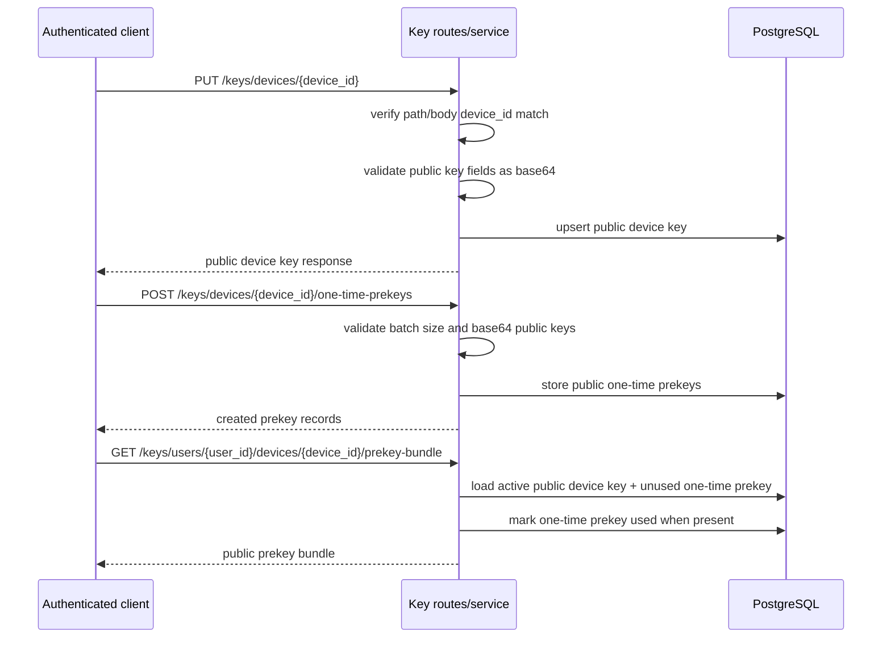
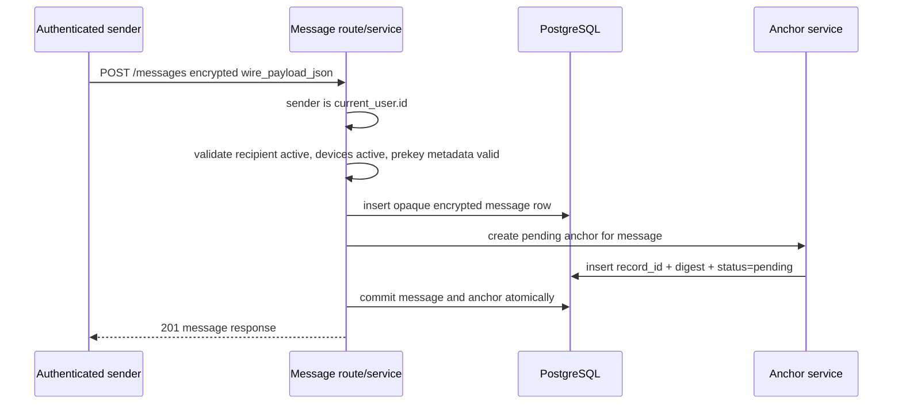
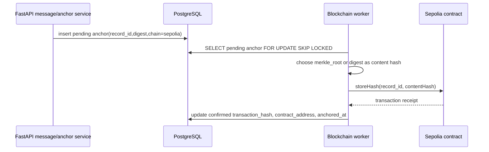

# Backend Architecture

Date updated: 2026-06-03

## Purpose

The backend is the API and database layer for the secure messaging system. It authenticates users, validates requests, stores public key material, relays encrypted direct 1:1 message payloads, enforces message-level authorization, records audit events, creates blockchain fidelity anchor metadata, and exposes status/verification endpoints for those anchors.

Backend boundaries:

- Message plaintext stays on client devices.
- Long-term private keys stay on client devices.
- Signal/libsignal session state stays on client devices.
- FastAPI request handlers create pending blockchain anchors but do not hold wallet credentials or submit Sepolia transactions.
- The backend blockchain worker is the deployed process that reads pending anchors and submits them to Sepolia.

## Assessed Backend Responsibilities

| Responsibility from brief | Backend implementation |
| --- | --- |
| Backend service accepts and processes requests | FastAPI `/api/v1` routes for auth, users, keys, messages, and blockchain anchors. |
| Secure client/server connectivity | Public HTTPS through the TLS gateway, Nginx proxy on VM, localhost Uvicorn, FastAPI HTTPS/HSTS controls. |
| Server-side authentication | Argon2id password hashes, signed JWT access tokens, HMAC-hashed refresh tokens, refresh rotation, logout revocation. |
| Server-side authorization | `get_current_user()` dependency and service-level object checks for message/key/anchor access. |
| Secure database use | Async SQLAlchemy ORM with PostgreSQL, migrations, repository layer, no string-built request SQL. |
| Input validation | Strict Pydantic schemas, UUID/positive ID/base64/wire-payload validation, sanitized validation errors. |
| Sensitive data protection | No plaintext/private-key storage; response schemas omit password and refresh-session hashes; audit detail allowlist. |
| Blockchain fidelity proof | Pending anchors from encrypted message metadata; worker submission to `MessageFidelity.storeHash` on Sepolia. |
| Vulnerability evidence | Unit, integration, security, Bandit, pip-audit, and DB-backed test results recorded in security docs. |

## Runtime Topology



### Runtime Processes

| Process | File/config | Role |
| --- | --- | --- |
| FastAPI app | `backend/app/main.py` | Creates app, installs CORS, security headers, HTTPS enforcement, validation sanitization, and `/api/v1` routing. |
| Uvicorn API service | `backend/deploy/epic-messaging-api.service` | Runs the API on the VM, bound behind Nginx. |
| Nginx reverse proxy | `backend/deploy/nginx/epic-messaging-api.conf` | Receives gateway traffic, applies public-edge rate limits, forwards to Uvicorn. |
| PostgreSQL | Deployment/runbook | Stores application data and migration-created schema. |
| Blockchain worker | `backend/deploy/epic-messaging-blockchain-worker.service` | Runs separately from FastAPI, reads pending anchor rows, submits contract transactions, records confirmations. |

## Code Layering

```text
HTTP request
  -> FastAPI router
  -> route dependencies
  -> service workflow
  -> repository query/persistence
  -> AsyncSession transaction
  -> PostgreSQL tables
```

| Layer | Files | Responsibility |
| --- | --- | --- |
| App setup | `backend/app/main.py` | CORS, HTTPS/security headers, validation sanitization, router registration. |
| API routes | `backend/app/api/v1/*.py` | HTTP paths, status codes, request/response models, dependency wiring. |
| Dependencies | `backend/app/api/deps.py` | Per-request DB session, Bearer token parsing, active-user loading, rate-limit checks. |
| Services | `backend/app/services/*.py` | Business rules, transactions, authorization, audit calls, token workflows, anchor creation. |
| Repositories | `backend/app/repositories/*.py` | SQLAlchemy query construction and persistence operations. |
| Schemas | `backend/app/schemas/*.py` | Pydantic validation and serialization boundaries. |
| Models | `backend/app/models/*.py` | PostgreSQL tables mapped through SQLAlchemy ORM. |
| Migrations | `backend/alembic/versions/*.py` | Schema creation and evolution. |
| Worker | `backend/app/workers/blockchain_worker.py` | Sepolia contract submission from pending anchor rows. |
| Tests | `backend/tests/*` | Unit, integration, and security evidence. |

## HTTP Request Lifecycle

Every API request follows the same security order:

1. The client sends JSON over HTTPS to the public hostname.
2. The TLS gateway terminates the public certificate and forwards traffic to the VM.
3. Nginx applies edge request limits and proxies to local Uvicorn.
4. FastAPI middleware enforces HTTPS semantics when configured, adds security headers, and sanitizes validation errors.
5. Route dependencies create an `AsyncSession`, parse Bearer credentials when required, and enforce route-specific rate limits.
6. Pydantic validates body, path, and query input before service logic runs.
7. Service functions apply business rules and object-level authorization.
8. Repository functions build SQLAlchemy ORM queries against PostgreSQL.
9. The service commits or rolls back the transaction.
10. Response schemas serialize only the fields intended for the caller.

This order matters because invalid input is rejected before DB workflows, authentication happens before protected service logic, and object authorization happens before message or anchor records are returned.

## Authentication Lifecycle



Important details:

- Duplicate registration and login errors are generic.
- Password hashes are Argon2id PHC strings.
- Access tokens contain required signed claims and `type=access`.
- Refresh-token DB rows contain HMAC hashes, not raw refresh tokens.
- Refresh rotation revokes the old session and creates a new session under row lock.
- Logout revokes the submitted refresh token without confirming whether it existed.

Evidence: `backend/app/services/auth_service.py`, `backend/app/services/password_service.py`, `backend/app/services/token_service.py`, `backend/app/api/deps.py`, auth tests.

## Public Key Relay Lifecycle



Security properties:

- Only authenticated users upload keys.
- Uploaded key material is public key/signature material only.
- Private-key fields are not modeled or stored.
- One-time prekey consumption is recorded in the backend database.
- The backend cannot prove the encrypted payload used the consumed prekey; the client cryptography deliverable proves protocol correctness.

Evidence: `backend/app/api/v1/keys.py`, `backend/app/schemas/device_key.py`, `backend/app/schemas/one_time_prekey.py`, key route/repository tests.

## Message Send Lifecycle



Security properties:

- Request body cannot set `sender_user_id`.
- Recipient user and sender/recipient devices must be active.
- Optional `consumed_one_time_prekey_id` must match a recipient/device prekey that was already consumed by bundle fetch.
- `wire_payload_json` is validated for structure and size, then stored as opaque encrypted data.
- The backend does not decrypt or inspect plaintext.
- A pending anchor is created in the same DB transaction as the message.

Evidence: `backend/app/schemas/message.py`, `backend/app/services/message_service.py`, `backend/app/repositories/message_repository.py`, `backend/app/services/blockchain_anchor_service.py`, message and blockchain tests.

## Message Read, Forward, Revoke, And Delete Lifecycles

### Read And List

- Inbox queries return messages visible to the authenticated recipient.
- Sent queries return messages visible to the authenticated sender.
- Direct message fetch uses sender/recipient visibility checks.
- Inaccessible messages return safe not-found responses.

### Forward

1. The user requests a forward for an existing message ID.
2. The service loads the original message only if visible to the current user.
3. The request supplies a new encrypted `wire_payload_json` for the new recipient.
4. The service creates a new message row with server-controlled `forwarded_from_message_id`.
5. A new pending blockchain anchor is created for the forwarded message.

Forwarding preserves auditable provenance without decrypting or copying plaintext.

### Revoke

- Only the sender can revoke recipient access.
- Revocation sets `access_revoked_at`.
- Recipient reads stop returning the revoked message.

### Delete

- Sender delete sets sender visibility state.
- Recipient delete sets recipient visibility state.
- Delete is not an immediate physical deletion because auditability and sender/recipient visibility are separate.

Evidence: `backend/app/services/message_service.py`, `backend/app/repositories/message_repository.py`, message route/security tests.

## Blockchain Anchor Lifecycle



Backend hashing:

- `derive_message_record_id(message_id)` returns `keccak256("message:" + message_id)`.
- `derive_message_digest(message)` returns Keccak over canonical JSON containing message ID, sender/recipient IDs, device IDs, timestamp, encrypted `wire_payload_json`, and forwarding lineage.
- Digest input excludes plaintext, private keys, and client ratchet/session state.

Worker behaviour:

- The worker imports `web3` lazily so normal API imports do not require blockchain runtime use.
- `MessageFidelitySubmitter.from_settings()` requires Sepolia RPC URL, worker wallet private key, contract address, chain ID, gas limit, and receipt timeout.
- Pending rows are locked with `FOR UPDATE SKIP LOCKED` to prevent duplicate submissions by parallel workers.
- Successful receipts update `status="confirmed"`, `transaction_hash`, `contract_address`, `merkle_root`, and `anchored_at`.
- Malformed anchors are marked failed; transient submission errors roll back unless configured to mark failed.

Production deployment:

- The production backend runs the blockchain worker as a separate service with required environment variables.
- FastAPI keeps wallet credentials out of request handlers.
- Sepolia/RPC/worker outages leave anchors pending; persisted pending rows are processed when the worker resumes.

Evidence: `backend/app/core/blockchain_hashing.py`, `backend/app/services/blockchain_anchor_service.py`, `backend/app/workers/blockchain_worker.py`, `backend/deploy/epic-messaging-blockchain-worker.service`, blockchain tests.

## Database Model Summary

| Table/model | Purpose | Security notes |
| --- | --- | --- |
| `users` | Account identity and password hash | Stores Argon2id password hash, not plaintext password. |
| `refresh_sessions` | Refresh-token session state | Stores HMAC hash, JTI, expiry, revocation time, IP/user-agent metadata. |
| `device_keys` | Public device key bundle | Stores public identity/signing/signed-prekey material only. |
| `one_time_prekeys` | Public one-time prekeys | Tracks consumption with `used_at`. |
| `messages` | Opaque encrypted direct messages | Stores ciphertext payload and routing/visibility metadata. |
| `blockchain_anchors` | Fidelity proof metadata | Stores record ID, digest/root, chain, status, tx hash, contract, anchor time. |
| `audit_logs` | Security/audit events | Stores allowlisted event details. |

Migrations:

- `20260527_0001_create_initial_secure_messaging_schema.py`
- `20260602_0002_extend_blockchain_anchor_metadata.py`
- `20260602_0003_add_message_forwarding_lineage.py`

## Database Access Pattern

- `backend/app/db/session.py` creates async SQLAlchemy engine/session handling.
- Each request receives an `AsyncSession` from the dependency layer.
- Services own commits and rollbacks.
- Repositories build ORM statements and return models.
- Refresh rotation and blockchain worker queue processing use row locking for concurrency-sensitive workflows.
- The application expects a `postgresql+asyncpg://` database URL.

## Security Controls In The Architecture

| Control | Where it sits |
| --- | --- |
| TLS/public certificate | Public gateway and client validation path |
| Edge request limit | Nginx |
| HTTPS/HSTS/security headers | FastAPI middleware |
| CORS policy | FastAPI CORS setup and settings validation |
| Request validation | Pydantic schemas before service logic |
| Authentication | `get_current_user()` dependency and token service |
| Authorization | Service/repository object predicates |
| Password hashing | Auth/password service |
| Refresh-token replay control | Auth service and refresh-session repository |
| Injection prevention | SQLAlchemy repositories |
| Sensitive data minimization | Schemas, audit service, validation sanitization |
| Blockchain fidelity | Message service, anchor service, hashing helpers, worker |

## Explicit Non-Goals

- Plaintext message storage.
- Message decryption.
- Private key storage.
- Server-side Signal ratchet/session state.
- Group chat or conversation model.
- Direct Ethereum transaction submission from FastAPI request handlers.
- Admin audit-log viewer.
- Distributed rate limiter.
- MFA.
