# Network And Deployment Architecture

## Public Entry Point

External users access the API through:

```text
https://kfc.theburkenator.com
```

FastAPI's generated documentation is available at:

```text
https://kfc.theburkenator.com/docs
```

## Current Deployment Shape

```mermaid
flowchart LR
    User["Client Device"] -->|"HTTPS TLS 1.2/1.3"| Domain["https://kfc.theburkenator.com"]
    Domain -->|"SSL termination at gateway"| Gateway["Provided Reverse Proxy / Gateway"]
    Gateway -->|"HTTP internal network to port 80"| VM["Team VM: kfc"]
    VM --> Nginx["Nginx :80"]
    Nginx -->|"HTTP localhost"| FastAPI["FastAPI / Uvicorn :8000"]
    FastAPI -->|"postgresql+asyncpg localhost"| Postgres[("PostgreSQL Docker :5432")]
```



Public internet traffic to the gateway is encrypted. Traffic from the gateway to the VM is internal HTTP because SSL termination is handled by the provided gateway. Nginx is the public HTTP listener on the VM and proxies to FastAPI on `127.0.0.1:8000`. FastAPI should not be exposed directly to the public internet.

## Components

| Component | Role | Port / Binding | Notes |
| --- | --- | --- | --- |
| Client | Browser, C++ client, or API client | HTTPS `443` to `kfc.theburkenator.com` | Client verifies gateway certificate through platform trust store |
| Provided gateway | Public TLS termination and forwarding | HTTPS `443` public, HTTP to VM `:80` | Uses Let's Encrypt certificate for the public hostname |
| Nginx on VM | Public HTTP listener on VM | `:80` | Proxies API/docs traffic to FastAPI |
| FastAPI / Uvicorn | Backend application | Recommended `127.0.0.1:8000` | Authenticates users, validates API requests, enforces access control |
| PostgreSQL Docker | Database | Recommended `127.0.0.1:5432` | Stores users, token-session hashes, public keys, encrypted payloads, audit logs |

## Request Flow

1. Client resolves `kfc.theburkenator.com`.
2. Client establishes HTTPS to the public gateway and validates the certificate chain and hostname.
3. Gateway terminates TLS and forwards the request to the VM on port `80`.
4. Nginx receives HTTP on port `80`.
5. Nginx proxies to FastAPI on `127.0.0.1:8000`.
6. FastAPI validates authentication, request shape, object authorization, and rate limits.
7. FastAPI uses SQLAlchemy/asyncpg to query PostgreSQL.

## VM Ports

Recommended exposed ports:

| Port | Should be public? | Purpose |
| --- | --- | --- |
| `80/tcp` | Yes, to gateway/internal network as required | Nginx listener receiving gateway-forwarded traffic |
| `8000/tcp` | No | FastAPI internal Uvicorn listener |
| `5432/tcp` | No | PostgreSQL Docker bound to localhost |
| `22/tcp` | Restricted | SSH administration |

Check listening ports on the VM:

```bash
sudo ss -tulpn
sudo ss -tulpn | grep ':80'
sudo ss -tulpn | grep ':8000'
sudo ss -tulpn | grep ':5432'
```

## Nginx Role

Nginx should be the public VM process that receives traffic from the gateway and forwards it to FastAPI:

```nginx
server {
    listen 80;
    server_name kfc.theburkenator.com;

    location / {
        proxy_pass http://127.0.0.1:8000;
        proxy_set_header Host $host;
        proxy_set_header X-Real-IP $remote_addr;
        proxy_set_header X-Forwarded-For $proxy_add_x_forwarded_for;
        proxy_set_header X-Forwarded-Proto https;
    }
}
```

The exact VM config can differ, but the security requirement is that clients do not connect directly to Uvicorn.

## FastAPI Connectivity

Local development command:

```bash
uvicorn app.main:app --host 127.0.0.1 --port 8000
```

Recommended VM command behind Nginx:

```bash
.venv/bin/uvicorn app.main:app --host 127.0.0.1 --port 8000
```

The current `backend/deploy/install-api-service.sh` writes a systemd service using `--host 0.0.0.0 --port 8000`. If that installer is used for submission, either change the generated `ExecStart` to bind `127.0.0.1` or firewall port `8000` so Uvicorn is not reachable directly from outside the VM.

## PostgreSQL Connectivity

The backend uses:

```text
postgresql+asyncpg://...
```

Recommended local Docker binding:

```bash
docker run --name epic-postgres \
  -e POSTGRES_DB=secure_messages \
  -e POSTGRES_USER=secure_app_user \
  -e POSTGRES_PASSWORD=change_me \
  -p 127.0.0.1:5432:5432 \
  -d postgres:16
```

Security assumptions:

- PostgreSQL is reachable only from the VM/backend host.
- Database credentials are in `.env`, not committed source files.
- `TEST_DATABASE_URL` points at a separate test database whose name contains `test`.
- Alembic migrations are run before starting the API.

## CORS And Headers

Implemented in code:

- CORS is only installed when `ALLOWED_ORIGINS` is non-empty.
- `APP_ENV=production` rejects `ALLOWED_ORIGINS=["*"]`.
- `CORS_ALLOW_CREDENTIALS=false` is the default.
- Security headers are added when `SECURITY_HEADERS_ENABLED=true`:
  - `X-Content-Type-Options: nosniff`
  - `X-Frame-Options: DENY`
  - `Referrer-Policy: no-referrer`
  - `Cache-Control: no-store`

Not currently implemented in FastAPI code:

- FastAPI does not currently enforce `ENFORCE_HTTPS`.
- FastAPI does not currently inspect `X-Forwarded-Proto`.
- FastAPI does not currently set `Strict-Transport-Security`.

Those controls should be applied at the gateway/Nginx layer if required for production hardening.

## External Services

The implemented backend depends on:

- Public TLS gateway for `kfc.theburkenator.com`
- Nginx on the team VM
- PostgreSQL

No backend route currently calls an external blockchain node, email provider, cloud KMS, or third-party messaging service. Message send and forward create pending blockchain anchor rows in PostgreSQL, but Sepolia submission belongs to a separate worker/script. That worker should be the only component that holds blockchain wallet credentials and calls the Solidity contract.

## TLS Evidence Utility

`backend/scripts/check_tls_connection.py` is an operator utility that resolves a host and establishes certificate-verified TLS using Python `socket` and `ssl`.

Example:

```bash
cd server/backend
.venv/bin/python scripts/check_tls_connection.py kfc.theburkenator.com --port 443
```

Successful evidence includes resolved IP addresses, TLS version, cipher suite, certificate subject, certificate issuer, and certificate expiry. Do not run active scans against production without permission.

## Residual Network Risks

- Public TLS terminates at the provided gateway, not inside FastAPI.
- The gateway-to-VM hop is internal HTTP.
- FastAPI HTTPS/HSTS enforcement is not implemented in application code.
- In-memory rate limiting is not distributed.
- Blockchain anchor confirmation is not completed by the FastAPI request path.
- PostgreSQL and FastAPI run on the same VM for the prototype.
- Certificate renewal and gateway configuration are operational responsibilities outside this repository.
