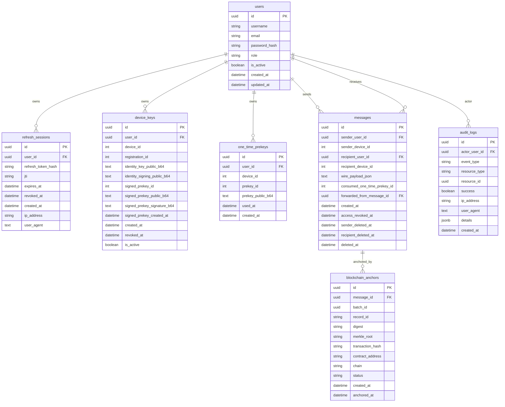

# Database Design

## Overview

The backend uses PostgreSQL through async SQLAlchemy and Alembic. The first migration is `20260527_0001_create_initial_secure_messaging_schema.py`.

The schema supports:

- User authentication
- Refresh-token rotation
- Public device key relay
- Public one-time prekey relay
- Opaque encrypted direct message relay
- Automatic pending blockchain proof metadata storage
- Audit/security event logging

The backend refuses database sessions unless `DATABASE_URL` uses the `postgresql+asyncpg://` scheme.

## ERD



`alembic_version` is also created by Alembic to track the current migration revision.

## Tables

### `users`

Purpose: account identity and authentication metadata.

Important columns:

- `id`: UUID primary key
- `username`: unique user handle
- `email`: unique normalized email
- `password_hash`: Argon2id PHC string
- `role`: currently defaults to `user`
- `is_active`: active/inactive account flag
- `created_at`, `updated_at`: timestamps

Security relevance:

- Stores password hashes only, never plaintext passwords.
- Unique constraints on `username` and `email` support safe duplicate handling.
- `is_active` is checked during login and Bearer token authentication.

Indexes/constraints:

- `uq_users_username`
- `uq_users_email`
- `ix_users_username`
- `ix_users_email`
- `ix_users_is_active`

### `refresh_sessions`

Purpose: server-side refresh-token rotation, logout, expiry, and replay detection.

Important columns:

- `user_id`: owner
- `refresh_token_hash`: HMAC-SHA256 wrapped as `hmac_sha256:<digest>`
- `jti`: session identifier
- `expires_at`: refresh session expiry
- `revoked_at`: set when token is rotated or logged out
- `ip_address`, `user_agent`: non-secret audit/context fields

Security relevance:

- Raw refresh tokens are never stored.
- Refresh flow locks active session rows and revokes the old session before creating a new one.
- Replay of an old refresh token fails because `revoked_at` is set.

Indexes/constraints:

- `uq_refresh_sessions_refresh_token_hash`
- `uq_refresh_sessions_jti`
- `ix_refresh_sessions_user_id`
- `ix_refresh_sessions_expires_at`
- `ix_refresh_sessions_revoked_at`

### `device_keys`

Purpose: public key bundle storage for each user device.

Important columns:

- `user_id`
- `device_id`
- `registration_id`
- `identity_key_public_b64`
- `identity_signing_public_b64`
- `signed_prekey_id`
- `signed_prekey_public_b64`
- `signed_prekey_signature_b64`
- `signed_prekey_created_at`
- `is_active`, `revoked_at`

Security relevance:

- Stores public key material only.
- Does not store private keys, root keys, chain keys, ratchet state, or session state.
- Active/non-revoked checks are required before prekeys can be uploaded or bundles returned.

Indexes/constraints:

- `uq_device_keys_user_id_device_id`
- `ix_device_keys_user_id`
- `ix_device_keys_user_id_is_active`
- `ix_device_keys_revoked_at`

### `one_time_prekeys`

Purpose: public one-time prekey pool per user/device.

Important columns:

- `user_id`
- `device_id`
- `prekey_id`: logical client-side/public prekey identifier
- `prekey_public_b64`
- `used_at`
- `created_at`

Security relevance:

- Public prekey material only.
- `used_at` is set when the prekey bundle endpoint hands out a prekey.
- The message send route may include `consumed_one_time_prekey_id`, but the backend cannot prove the ciphertext cryptographically used that prekey.

Indexes/constraints:

- `uq_one_time_prekeys_user_id_device_id_prekey_id`
- `ix_one_time_prekeys_user_id_device_id`
- `ix_one_time_prekeys_user_id_device_id_used_at`

### `messages`

Purpose: direct 1:1 encrypted relay message storage.

Important columns:

- `sender_user_id`
- `sender_device_id`
- `recipient_user_id`
- `recipient_device_id`
- `wire_payload_json`
- `consumed_one_time_prekey_id`
- `forwarded_from_message_id`
- `access_revoked_at`
- `sender_deleted_at`
- `recipient_deleted_at`
- `deleted_at`

Security relevance:

- `wire_payload_json` is an opaque encrypted libsignal-v1 payload string.
- No plaintext `body`, `content`, or `plaintext` column exists.
- Sender identity is derived from the authenticated user in service logic, not client body data.
- Forward provenance is stored as a nullable self-reference controlled by the backend after original-message access is verified.
- Recipient visibility checks exclude revoked, recipient-deleted, and deleted rows.
- Sender visibility checks exclude sender-deleted and deleted rows.

Indexes/constraints:

- `ix_messages_recipient_user_id_device_id_created_at`
- `ix_messages_sender_user_id_created_at`
- `ix_messages_forwarded_from_message_id`
- `ix_messages_access_revoked_at`
- `ix_messages_sender_deleted_at`
- `ix_messages_recipient_deleted_at`
- `ix_messages_deleted_at`

### `blockchain_anchors`

Purpose: integrity proof metadata associated with encrypted messages or future batches.

Important columns:

- `message_id`
- `batch_id`
- `record_id`
- `digest`
- `merkle_root`
- `transaction_hash`
- `contract_address`
- `chain`
- `status`
- `created_at`
- `anchored_at`

Security relevance:

- Stores hashes and transaction metadata only.
- Message send and forward create pending anchors automatically.
- `record_id` is derived as `keccak256("message:" + message_id)` for message anchors.
- `digest` is derived from a canonical encrypted message record, including opaque `wire_payload_json`, forwarding lineage when present, and metadata only.
- No plaintext, private keys, raw tokens, or ratchet state are stored in anchor rows.
- No FastAPI request handler submits blockchain transactions; the backend blockchain worker confirms pending anchors.

Indexes:

- `ix_blockchain_anchors_message_id`
- `ix_blockchain_anchors_batch_id`
- `ix_blockchain_anchors_record_id`
- `ix_blockchain_anchors_digest`
- `ix_blockchain_anchors_merkle_root`
- `ix_blockchain_anchors_transaction_hash`
- `ix_blockchain_anchors_status`

### `audit_logs`

Purpose: security event evidence for authentication, key relay, message actions, and denied access attempts.

Important columns:

- `actor_user_id`
- `event_type`
- `resource_type`
- `resource_id`
- `success`
- `ip_address`
- `user_agent`
- `details`
- `created_at`

Security relevance:

- Details are allowlisted and sanitized by `audit_service`.
- Passwords, tokens, key material, and `wire_payload_json` are not stored in audit details.
- Denied object access is recorded without exposing the protected object.

Indexes:

- `ix_audit_logs_actor_user_id`
- `ix_audit_logs_event_type`
- `ix_audit_logs_created_at`
- `ix_audit_logs_success`
- `ix_audit_logs_resource_type_resource_id`

### `alembic_version`

Purpose: Alembic-managed migration tracking table.

Security relevance:

- Confirms the deployed database schema revision.
- Should be checked before deployment to ensure code and database are aligned.

## Sensitive Data Summary

Stored:

- Argon2id password hashes
- HMAC refresh-token hashes
- JWT/refresh secrets in environment configuration only
- Public key material
- Public one-time prekeys
- Encrypted opaque message relay payloads
- Message metadata
- Blockchain anchor record IDs, digests, roots, transaction metadata, and statuses
- Audit metadata

Not stored:

- Plaintext passwords
- Raw refresh tokens
- Private keys
- Signal ratchet/session state
- Plaintext message bodies
- Group/conversation records

## Migration Commands

From `server/backend`:

```bash
alembic upgrade head
alembic current
alembic history
```

Rollback should be used only in controlled local/test environments:

```bash
alembic downgrade -1
```
