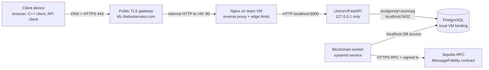

# Network And Deployment Threat Model

Date updated: 2026-06-03

## Scope

This threat model covers the deployed network path and operational environment for the backend service. It focuses on DNS/hostname resolution, public TLS, the provided gateway, Nginx on the team VM, local Uvicorn/FastAPI binding, PostgreSQL binding, systemd services, deployment secrets, operational checks, and the backend blockchain worker's outbound Sepolia connection.

The application threat model for backend routes, database records, authentication, authorization, message relay, and blockchain anchor metadata is documented separately in `docs/security/threat_model.md`.

## Brief Requirements Covered

The Computer Networks and Cybersecurity brief asks for secure client/server connectivity, certificate validation, documented network architecture, server-side security controls, tested request processing, vulnerability testing, and resilience against common vulnerabilities.

Network/deployment evidence for these requirements is:

- Public TLS path and topology: `docs/architecture/network_architecture.md`.
- VM runbook and operational checks: `docs/deployment/runbook.md`.
- Nginx reverse proxy and edge rate limits: `backend/deploy/nginx/epic-messaging-api.conf`.
- API systemd service bound to localhost: `backend/deploy/epic-messaging-api.service`.
- Blockchain worker systemd service: `backend/deploy/epic-messaging-blockchain-worker.service`.
- TLS verification utility: `backend/scripts/check_tls_connection.py`.
- Security header and HTTPS tests: `backend/tests/integration/test_security_headers.py`.
- Rate-limit tests: `backend/tests/security/test_rate_limit_security.py`, `backend/tests/integration/test_rate_limiting.py`.
- Final validation evidence: `docs/security/security_test_results.md`.

## Deployment Overview

Deployment boundaries:

- Public users connect to `https://kfc.theburkenator.com`.
- TLS is terminated by the provided gateway using the public hostname certificate.
- The gateway forwards traffic to the VM on port `80`.
- Nginx is the VM's public HTTP listener and proxies to Uvicorn on `127.0.0.1:8000`.
- Uvicorn/FastAPI is not exposed directly to the public internet.
- PostgreSQL is bound to `127.0.0.1:5432`.
- Real `.env` values are deployment secrets and are not committed.
- The blockchain worker is separate from FastAPI and uses Sepolia environment settings.

## Assets

| Asset | Security property needed | Deployment location |
| --- | --- | --- |
| Public hostname | Authenticity and correct routing | DNS/gateway for `kfc.theburkenator.com` |
| TLS certificate | Authenticity, validity, expiry control | Provided public gateway |
| Client requests and responses | Confidentiality and integrity on public internet | HTTPS client to gateway |
| Gateway-to-VM traffic | Integrity and availability inside provided infrastructure | Internal HTTP hop to VM port `80` |
| Nginx configuration | Integrity and availability | `/etc/nginx/sites-available/epic-messaging-api` |
| Uvicorn process | Availability and localhost-only exposure | `epic-messaging-api.service` |
| PostgreSQL service/container | Confidentiality, integrity, availability | local VM binding on `127.0.0.1:5432` |
| Backend `.env` file | Confidentiality and integrity | VM filesystem/systemd `EnvironmentFile` |
| JWT and refresh-token secrets | Confidentiality | `.env`, loaded by FastAPI service |
| Database credentials | Confidentiality | `.env`, PostgreSQL auth |
| Sepolia RPC URL and worker wallet key | Confidentiality, integrity | `.env`, loaded by blockchain worker service |
| Logs | Integrity and limited disclosure | systemd journal, backend log, Nginx logs |
| Deployment scripts | Integrity | `backend/deploy/*` |

## Trust Boundaries

| Boundary | Trusted side | Untrusted or less-trusted side | Main control |
| --- | --- | --- | --- |
| Client to public hostname | Client platform trust store and gateway certificate | Public internet | TLS 1.2/1.3 and hostname validation |
| Gateway to VM | Provided university/project infrastructure | Public clients and arbitrary headers | Gateway forwarding plus Nginx fixed proxy headers |
| Nginx to Uvicorn | Local VM loopback | Public network | Uvicorn bound to `127.0.0.1` |
| FastAPI to PostgreSQL | Local backend host | External network | PostgreSQL bound to `127.0.0.1` and DB credentials |
| systemd service to `.env` | VM filesystem permissions | Repository/source control | `.env` ignored, placeholders only in docs |
| Worker to Sepolia RPC | Worker process and configured wallet | Public internet/RPC provider | HTTPS RPC, signed Ethereum transactions, persisted DB queue |
| Operator to VM | Authorized SSH user | Internet | Restricted SSH and careful command/log handling |

## Attackers

| Attacker | Capability |
| --- | --- |
| Passive network attacker | Observes public internet traffic between clients and service. |
| Active network attacker | Attempts MITM, downgrade, DNS/hostname confusion, replay, header spoofing, or request modification. |
| Public API abuser | Sends high-volume auth, prekey, message, or docs/API requests. |
| Malicious client behind same gateway IP | Shares Nginx-visible source identity with other users if gateway hides real client IP. |
| Compromised gateway or misconfigured gateway | Alters forwarded traffic or reports wrong scheme/IP information. |
| Direct VM scanner | Probes ports `80`, `8000`, `5432`, and `22`. |
| Compromised VM user | Reads files, service config, logs, or environment values available to that account. |
| Database attacker | Attempts direct PostgreSQL access or credential reuse. |
| Sepolia/RPC attacker or outage | Blocks, delays, or fails blockchain worker submissions. |
| Operator mistake | Starts Uvicorn on public interfaces, prints secrets in screenshots, commits `.env`, or disables Nginx limits. |

## Network Attack Surfaces

- DNS/hostname resolution for `kfc.theburkenator.com`.
- Public TLS certificate, expiry, and hostname validation.
- Gateway forwarding to VM port `80`.
- Nginx request parsing, proxy headers, client body size, and `limit_req` zones.
- FastAPI HTTPS/HSTS interpretation through `X-Forwarded-Proto`.
- Uvicorn listener binding.
- PostgreSQL Docker port binding.
- SSH administration.
- systemd service files and environment files.
- Nginx, backend, worker, and PostgreSQL logs.
- Sepolia RPC endpoint used by the blockchain worker.

## STRIDE Analysis

| STRIDE category | Network/deployment threat | Control | Evidence |
| --- | --- | --- | --- |
| Spoofing | Attacker impersonates the backend with a fake hostname or certificate. | Clients connect to `https://kfc.theburkenator.com` and validate certificate chain and hostname. TLS probe verifies deployed certificate metadata. | `check_tls_connection.py`, network architecture doc |
| Spoofing | Client forges `X-Forwarded-For` or `X-Forwarded-Proto`. | Nginx sets proxy headers itself. Real-IP handling is restricted to trusted gateway addresses. FastAPI trusts forwarded proto only when deployment enables it behind the gateway. | Nginx config, `main.py`, runbook |
| Tampering | Traffic modified on public internet. | Public HTTPS protects request/response integrity to the gateway. JWT signatures and backend validation detect token/request tampering after delivery. | TLS path docs, token tests, validation tests |
| Tampering | Operator accidentally exposes Uvicorn or PostgreSQL publicly. | Systemd starts Uvicorn on `127.0.0.1:8000`; PostgreSQL runbook binds DB to `127.0.0.1:5432`; exposed-port checks are documented. | API service file, runbook |
| Repudiation | Team cannot prove deployment controls were applied. | Runbook records exact checks for Nginx config, systemd status, listening ports, TLS probe, migrations, smoke tests, and test commands. | deployment runbook |
| Information disclosure | Secrets appear in source, screenshots, logs, or validation output. | `.env` ignored, `.env.example` placeholders only, runbook says not to print secrets, validation errors are sanitized. | `.gitignore`, `.env.example`, runbook, `main.py` |
| Information disclosure | Plain HTTP hop after gateway exposes traffic inside infrastructure. | Public internet traffic remains TLS-protected; the internal HTTP hop is documented as a deployment boundary; Uvicorn and DB stay local. | network architecture doc |
| Denial of service | Login/register floods, prekey scraping, message spam, broad API bursts. | Nginx edge `limit_req` zones plus FastAPI IP/user fixed-window limits. | Nginx config, rate-limit tests |
| Elevation of privilege | Direct scanner reaches FastAPI or PostgreSQL and bypasses Nginx controls. | Uvicorn and PostgreSQL bind to localhost; only Nginx is the VM public listener. | service file, runbook exposed-port checks |

## Detailed Threats

### Passive Network Attacker

Threat: an attacker observes public internet traffic and tries to read credentials, tokens, public key uploads, encrypted message payloads, or API responses.

Controls:

- Public traffic uses HTTPS to `kfc.theburkenator.com`.
- Clients validate the public certificate chain and hostname through their platform trust store.
- The backend stores encrypted message payloads, not plaintext.
- The TLS probe utility records certificate subject, issuer, expiry, TLS version, and cipher suite.

Evidence:

- `docs/architecture/network_architecture.md`
- `backend/scripts/check_tls_connection.py`
- `backend/tests/integration/test_security_headers.py`

Residual risk:

- TLS terminates at the provided gateway. The gateway-to-VM hop is internal HTTP and is documented as an infrastructure boundary.

### Active Network Attacker

Threat: an attacker modifies traffic, redirects clients, injects proxy headers, attempts HTTPS downgrade, or tampers with requests before they reach FastAPI.

Controls:

- Public HTTPS prevents modification between client and gateway.
- FastAPI rejects non-HTTPS requests when `ENFORCE_HTTPS=true`.
- FastAPI emits HSTS on HTTPS responses when `HSTS_ENABLED=true`.
- `TRUST_X_FORWARDED_PROTO=true` is used only behind the trusted gateway/Nginx path.
- Nginx sets `Host`, `X-Real-IP`, `X-Forwarded-For`, and `X-Forwarded-Proto`.
- JWT signatures and Pydantic validation detect modified tokens and malformed inputs at the API layer.

Evidence:

- `backend/app/main.py`
- `backend/app/core/config.py`
- `backend/deploy/nginx/epic-messaging-api.conf`
- `backend/tests/integration/test_security_headers.py`

Residual risk:

- If the gateway is misconfigured or compromised, forwarded scheme and traffic integrity after TLS termination depend on the provided infrastructure. The runbook documents public TLS and VM-side checks separately.

### Direct VM Port Exposure

Threat: a scanner or attacker bypasses Nginx and connects directly to Uvicorn or PostgreSQL.

Controls:

- `epic-messaging-api.service` starts Uvicorn with `--host 127.0.0.1 --port 8000`.
- PostgreSQL deployment binds to `127.0.0.1:5432`.
- Nginx is the VM listener on port `80`.
- The runbook includes `ss -tulpn` checks for `:80`, `:8000`, and `:5432`.

Evidence:

- `backend/deploy/epic-messaging-api.service`
- `docs/deployment/runbook.md`
- `docs/architecture/network_architecture.md`

Residual risk:

- SSH and VM firewall rules are operational controls. The final runbook records the expected exposed-port state so it can be checked during deployment.

### Nginx Abuse And Rate Limiting

Threat: attacker floods login/register, refresh, prekey bundle fetch, message send, forward, docs, or general API routes.

Controls:

- Nginx defines separate `limit_req_zone` entries for register, login, refresh, prekey, message, and general API traffic.
- Nginx sets `client_max_body_size 1m`.
- FastAPI applies additional fixed-window limits keyed by direct IP for unauthenticated routes and user ID for authenticated routes.
- Route schemas also enforce payload size limits.

Evidence:

- `backend/deploy/nginx/epic-messaging-api.conf`
- `backend/app/core/rate_limit.py`
- `backend/app/api/deps.py`
- `backend/tests/security/test_rate_limit_security.py`
- `backend/tests/integration/test_rate_limiting.py`

Residual risk:

- If the gateway hides real client IPs, Nginx sees the gateway address. Real-IP handling is configured only for trusted gateway IPs, not arbitrary public headers.

### Secret And Environment Exposure

Threat: deployment secrets leak through source control, screenshots, logs, systemd config, shell history, or over-broad VM file permissions.

Controls:

- `.env` files are ignored and not committed.
- `.env.example` uses placeholders.
- Production settings reject short or placeholder JWT and refresh-token secrets.
- Worker settings reject missing Sepolia RPC URL, worker private key, or contract address when the worker is enabled.
- The runbook explicitly avoids printing secret values in screenshots or submission documents.

Evidence:

- `backend/.env.example`
- `backend/app/core/config.py`
- `docs/deployment/runbook.md`
- `backend/deploy/epic-messaging-api.service`
- `backend/deploy/epic-messaging-blockchain-worker.service`

Residual risk:

- The `.env` file is loaded by systemd services on the VM. Its confidentiality depends on VM user permissions and operator handling.

### PostgreSQL Deployment

Threat: attacker reaches PostgreSQL directly, steals credentials, modifies data, or causes database unavailability.

Controls:

- PostgreSQL is bound to `127.0.0.1:5432`.
- Backend connects with `postgresql+asyncpg://`.
- Credentials live in `.env`, not source.
- Alembic migrations define and update schema.
- Runbook records Docker health, logs, restart policy, port binding, and migration checks.

Evidence:

- `docs/deployment/runbook.md`
- `docs/database/database_design.md`
- `backend/alembic/versions/*.py`
- `backend/app/db/session.py`

Residual risk:

- PostgreSQL and FastAPI run on the same VM for the prototype. VM compromise can expose database records and credentials.

### Logs And Operational Evidence

Threat: logs leak secrets, operators lose forensic evidence, or the team cannot prove security controls were deployed.

Controls:

- Application validation errors remove submitted input.
- Audit logging uses allowlisted details.
- Runbook records `journalctl`, Nginx error logs, backend logs, TLS probe, smoke tests, rate-limit smoke test, migration checks, and dependency/test commands.
- Submission docs record final validation commands and results.

Evidence:

- `backend/app/main.py`
- `backend/app/services/audit_service.py`
- `docs/deployment/runbook.md`
- `docs/security/security_test_results.md`

Residual risk:

- Logs still contain operational metadata such as IPs, routes, timestamps, and service errors. Access to logs is restricted through VM permissions.

### Blockchain Worker Network Path

Threat: Sepolia RPC outage, wrong contract address, insufficient gas, wallet/key exposure, duplicate submissions, or worker downtime delays blockchain confirmation.

Controls:

- FastAPI request handlers never hold wallet credentials and never block on Sepolia.
- The worker reads persisted pending rows from PostgreSQL.
- Worker configuration validates required Sepolia RPC URL, private key, and contract address.
- Pending rows are selected with `FOR UPDATE SKIP LOCKED`.
- Confirmed submissions update transaction hash, contract address, and anchored timestamp.
- The worker runs as a systemd service with restart policy.

Evidence:

- `backend/app/workers/blockchain_worker.py`
- `backend/deploy/epic-messaging-blockchain-worker.service`
- `docs/deployment/runbook.md`
- `backend/tests/integration/test_blockchain_routes.py`

Residual risk:

- During RPC, Sepolia, wallet, gas, or worker outage, anchors remain pending until the worker resumes and processes the persisted queue.

## Deployment Checks For Evidence

These checks prove the network/deployment controls without exposing secrets:

| Control | Evidence command |
| --- | --- |
| Public TLS certificate | `.venv/bin/python scripts/check_tls_connection.py kfc.theburkenator.com --port 443` |
| Nginx active config | `sudo nginx -T | grep -n "server_name\\|proxy_pass\\|listen\\|limit_req"` |
| Nginx syntax | `sudo nginx -t` |
| API service bound locally | `sudo systemctl status epic-messaging-api` and `sudo ss -tulpn | grep ':8000'` |
| PostgreSQL bound locally | `sudo ss -tulpn | grep ':5432'` |
| Public listener | `sudo ss -tulpn | grep ':80'` |
| HTTPS response headers | `curl -I https://kfc.theburkenator.com/docs` |
| Auth rate-limit smoke test | repeated login curl from runbook returns `401` then `429` |
| Worker service status | `sudo systemctl status epic-messaging-blockchain-worker` |
| Pending/confirmed anchors | SQL query in runbook without printing secrets |

## Final Residual Risk Register

| Residual risk | Severity | Final control or boundary |
| --- | --- | --- |
| TLS terminates at provided gateway | Medium | Public internet traffic is HTTPS; internal HTTP hop is documented and bounded to gateway-to-VM infrastructure. |
| Gateway hides real client IP | Medium | Nginx real-IP handling is restricted to trusted gateway addresses; FastAPI also applies authenticated per-user limits. |
| FastAPI limiter is in-memory | Low/Medium | Nginx provides VM edge limits; distributed limits are outside single-VM prototype scope. |
| Uvicorn/PostgreSQL exposure due to operator mistake | High | systemd and runbook bind both to localhost; exposed-port checks are part of deployment evidence. |
| `.env` exposure on VM | High | `.env` is not committed; production settings reject weak placeholders; VM permissions and operator handling protect runtime secrets. |
| PostgreSQL and API share one VM | Medium | Local binding reduces network exposure; VM compromise remains a high-impact event. |
| Certificate renewal and gateway configuration | Medium | Gateway certificate checks are captured through TLS probe evidence; renewal is an operational responsibility. |
| Sepolia/RPC/worker outage | Medium | Pending anchors persist and the worker processes them after recovery. |
| Compromised client device | High | Network controls protect transport only; endpoint plaintext/private-key compromise is outside deployment scope. |
